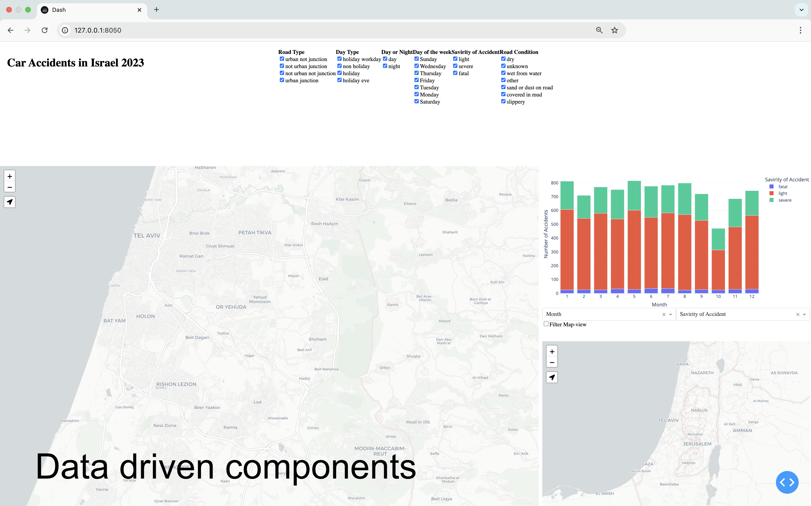
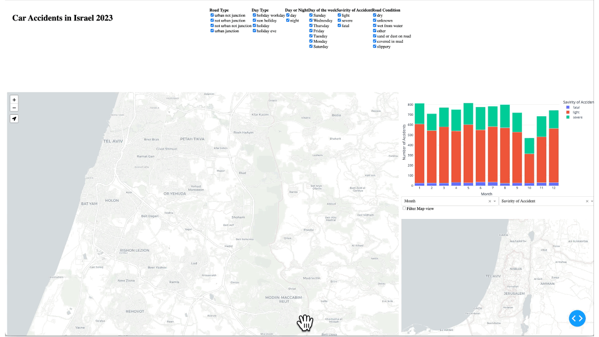
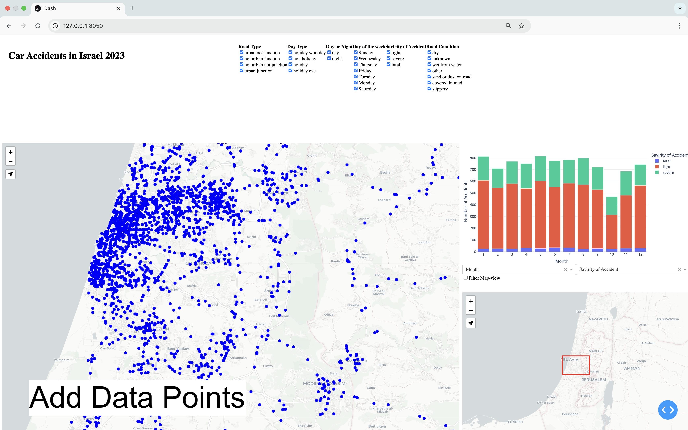
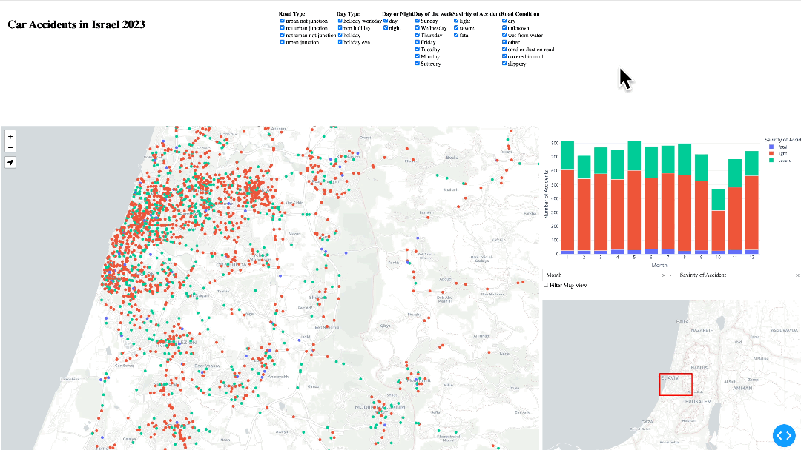

# 10 Steps to build Dashboard with Dash-plotly and Dash-Leaflet Maps

In this post, I’ll walk you through building a dashboard with a map step by step, using Dash-Plotly and Dash-Leaflet. Whether you’re a beginner/intermediate data scientist or transitioning a GIS analyst with data science tools, this guide will help you explore how to combine interactive visualizations with geographic data in a user-friendly interface.

Here’s what we’ll cover in this tutorial:
1.	Building a Complex Dashboard Step by Step: Learn to create a functional, interactive dashboard by designing it from scratch. We’ll walk through adding elements step by step, implementing callback interactivity, and applying styling to make it polished and user-friendly.
2.	Working with Geographic Data: Understand the basics of Dash-Leaflet for adding spatial data to your dashbaord.
3.	Best Practices in Python: Incorporate good coding practices to make your dashboard maintainable and scalable.
4.	Dash-Plotly Tricks: Simplify some challenging aspects of Dash-Plotly with helpful tips and techniques. 

The dashboard we’ll create will provide statistical insights and interactive map visualizations related to car accidents in Israel. It will feature a contextual bar graph that dynamically updates based on user selections, along with two maps: a large map displaying geographic data points and a smaller environmental map showing the bounding box of the larger map.

If you’re a data scientist exploring web technologies, Dash-Plotly offers a fantastic starting point for building interactive dashboards and applications. Dash-Plotly is essentially a Python framework built on React and Flask, combining frontend interactivity with Python’s simplicity. Here’s why it’s worth learning:
1. HTML and CSS Basics: Dash uses common tags as in HTML, it's an opportunity to learn foundational web design concepts for structuring and styling web-apps.
2. React Potential: Dash is a Python wrapper to React. Basicly it acts as a bridge to understanding React. You can quickly prototype ideas and later dive deeper into React’s capabilities.
3. Flask Framework: Since Dash is built on Flask, it introduces you to one of Python’s most popular frameworks for creating APIs and integrating frontend and backend functionalities.
4. Coding Practice: Unlike platforms like Tableau or Power BI, Dash requires you to code your dashboards, providing more flexibility and customization. However, this also means that your code can quickly become cumbersome and difficult to manage. Dash offers an opportunity to practice/learn writing clean, organized, and maintainable code—skills that are crucial for developing scalable and efficient applications.
5. Deployment Opportunities: Dash applications can be deployed on platforms like AWS, Azure, or GCP, giving you hands-on experience in web deployment.
6. Exploratory Data Analysis (EDA): Building a dashboard involves data wrangling, cleaning, and exploration—core skills for any data scientist. Dash makes EDA interactive and engaging.
7. Beyond Dashboards: Dash isn’t just for dashboards; it can power simulations, prototypes, or custom data-driven applications. Check out the Dash-Plotly Gallery for inspiration.

In addition to creating a classic interactive dashboard, a significant portion of this post focuses on Dash-Leaflet—a Dash wrapper for the popular JavaScript mapping library, Leaflet. If you’re unfamiliar with this Dash component, you can think of it as a tool similar to Folium (a Python wrapper for Leaflet) but designed specifically for Dash-Plotly. However, this comparison isn’t entirely accurate. Unlike Folium, Dash-Leaflet directly wraps the JavaScript Leaflet library, making it more similar to React-Leaflet, which is a React wrapper for Leaflet.

If the previous paragraph wasn’t entirely clear, that’s okay! The key takeaway about Dash-Leaflet is that it enables you to create Leaflet-like maps (with many of its powerful features) that seamlessly interact with Dash-Plotly.

Before diving into the implementation, it’s crucial to design the dashboard and plan the execution steps for building it effectively.

The goal of this dashboard is to gain insights into the spatio-temporal statistics of car accidents in Israel during 2023.

Here is the breakdown of the steps:
#### Part 1. Sketching the Dashboard's layout
1.	Sketch the Dashboard Concept: Start by sketching what you want the dashboard to showcase.
2.	Add Static Elements: Place static Plotly elements in the layout as placeholders.

#### Part 2. Data Driven conent
3.	Replace Static Elements: Exchange the static Plotly elements with data-driven plotly components from the dataset.
4.	Introduce Interactivity: Add initial callbacks to enable basic interaction between components.

#### Part 3. Setting up the map
5.	Enabled Environment Map: the environment map displays the boundig box of the main-maps viewport.
6.  Load Geographic Data: Integrate geographic data into the map.
7.	Unify Styling: Match the styles of the graph and map components for a cohesive design.
8.	Add Cluster Layers: Include clustering functionality on the environment map.

#### Part 4. Enabling interacitivy between the map and the other component of the dashboard
9. 	Filter by viewport: Enable interactions where data displayed  on the map viewports updates the graphs, and vice versa.


#### Part 5. Fine tuning the style using CSS
10.	Enhance Visual Design: Use CSS to refine the map’s appearance and overall dashboard aesthetics.


The following gif animation displays (more-less) the different steps described above.


The source of the data comes from accdients dataset From data.gov.il (Israel open source govemenral data website),
The data has been processed and translated to enlgish in order to simplify the process.

So without further due lets start learning how to build the dashboard step by step!

## 0. Setting up an environment
 Setting up a development environment is beyond the scope of this blog post, with that said,  we highly recommend creating a dedicated virtual environment specifically for this project. This approach helps keep dependencies organized and prevents conflicts with other projects. Once the virtual environment is ready, install the required libraries to proceed.

```sh
pip install -r requirements.txt
```

# Sketching the Dashboard's layout

## 1. Sketching the Dashboard's layout

Typically, the first step in designing a dashboard is to define the key questions the dashboard aims to address. Once these are clear, it’s helpful to sketch the layout and components on paper (preferably) to plan the structure effectively. However, in this blog, we’ll skip the planning phase and fast-forward into creating the initial dashboard layout using code.

In the following code, I created a 3x3 grid layout using html.Div elements and added placeholders as titles for the components I intend to include. I then merged some of the components that I anticipated would require more screen space, using the girdColumn/girdRow:span in the style. The resulting layout can be seen in the screenshot below the code snippet. 

```python
from dash import Dash, html
import plotly.express as px

app = Dash()


cell_style = {'padding': '20px',
              'text-align': 'center'}

# Set the layout right the first time!
app.layout = html.Div(
    style={
        'display': 'grid',
        'gridTemplateColumns': '33% 33% 33%',
        'gridTemplateRows': '20% 40% 40%',
        'gap': '10px',
        'height': '100vh',
        'width': '100vw',
    },
    children=[
        html.Div('Title', style={
                 'backgroundColor': 'lightblue', **cell_style}),
        html.Div('Filters', style={
                 'backgroundColor': 'lightgreen', 'gridColumn': 'span 2', **cell_style}),
        html.Div('Main Map', style={'backgroundColor': 'lightcoral',
                 **cell_style, 'gridColumn': 'span 2', 'gridRow': 'span 2'}),
        html.Div(['Graph with Filed Selection'], style={
                 'backgroundColor': 'lightgoldenrodyellow', **cell_style}),
        html.Div(['Env Map'], style={
                 'backgroundColor': 'lightpink', **cell_style})
    ]
)
if __name__ == "__main__":
    app.run(debug=True)
```
> **Note:** In the code, I incorporated some CSS styling practices and utilized html.Div components from Dash-Plotly. These concepts are rooted in the CSS/HTML front-end development context, which is beyond the scope of this blog post. However, if you’re curious or need more details, feel free to consult your GPT or search the internet for further information.


## 2. Add Static Elements

After setting up the initial layout, the next step is to place the Plotly and Leaflet elements within their designated div containers. Below, you’ll find the code snippets along with comments explaining what was done and why. At the end of this section, you’ll see a snapshot of the result at this stage. 

> **Note:** The following code simply copies sample code from the Dash-Plotly/Plotly tutorial into the various div containers in the layout. This step serves primarily as a placeholder for the UI widgets. Since there’s nothing particularly complex about this step, I won’t go into detailed explanations here.

<details>
  <summary>Click to expand the code snippet</summary>

```python
from dash import Dash, html, dcc, callback, Output, Input
import dash_leaflet as dl
import plotly.express as px
import pandas as pd
import os

##### Load data

# get the absolute dir location of the working file
file_dir = os.path.dirname(__file__)


# Processed data from https://data.gov.il/dataset/2023-puf
df = pd.read_csv(os.path.join(file_dir, 'accidents_2023_processed.csv'))

# At this step the dataframe will only be used to generate a static figure that is not yet linked to the other parts of the dashbaord

# Generate monthly accidents counts grouped by accident severity, this will be used in creating the figure in next part 
monthly_accidents = df.groupby(
    ['HODESH_TEUNA', 'HUMRAT_TEUNA']).size().reset_index(name='count')

# Inital plot placeholder for dashbaord, we used the accidents count calculated above
fig = px.bar(monthly_accidents, x='HODESH_TEUNA', y='count', color='HUMRAT_TEUNA',
             title='Number of Accidents per Month', template='plotly_white')
fig.update_layout(xaxis=dict(tickmode='linear'),
                  margin=dict(l=0, r=0, t=25, b=25), height=400)

# Main Map Component
dah_main_map = dl.Map([
                    dl.TileLayer(
                        url='https://{s}.basemaps.cartocdn.com/light_all/{z}/{x}/{y}{r}.png'),

                    dl.LocateControl(
                        locateOptions={'enableHighAccuracy': True})
                ],
                    center=[32, 34.9],
                    zoom=12,
                    style={'height': '100%'},
                    id='main_map',
                    dragging=True,
                    zoomControl=True,
                    scrollWheelZoom=True,
                    doubleClickZoom=True,
                    boxZoom=True,
                )

# Environmental Map Component
dash_env_map = dl.Map([
                    dl.TileLayer(
                        url='https://{s}.basemaps.cartocdn.com/light_all/{z}/{x}/{y}{r}.png')
                ],
                    center=[32, 34.9],
                    zoom=8,
                    style={'height': '100%'},
                    id='env_map',
                    dragging=False,
                    zoomControl=False,
                    scrollWheelZoom=False,
                    doubleClickZoom=False,
                    boxZoom=False,
                )
app = Dash()


cell_style = {'padding': '20px'}
# Set the layout right the first time!
app.layout = html.Div(
    style={
        'display': 'grid',
        'gridTemplateColumns': '33% 33% 33%',
        'gridTemplateRows': '26% 37% 37%',
        'gap': '10px',
        'height': '100vh',
        'width': '100vw'
    },
    children=[
        # Main Title
        html.Div(
            html.H1('Car Accidents in Israel 2023'),
            style={**cell_style}
        ),
        # Filters Section
        html.Div(
            [
                html.Div(
                    [
                        html.B('Filter 1'),
                        dcc.Checklist(
                            ['New York City', 'Montréal', 'San Francisco'],
                            ['Montréal', 'San Francisco']
                        )
                    ]
                ),
                html.Div(
                    [
                        html.B('Filter 2'),
                        dcc.Checklist(
                            ['New York City', 'Montréal', 'San Francisco'],
                            ['Montréal', 'San Francisco']
                        )
                    ]
                ),
                html.Div(
                    [
                        html.B('Filter 3'),
                        dcc.Checklist(
                            ['New York City', 'Montréal', 'San Francisco'],
                            ['Montréal', 'San Francisco']
                        )
                    ]
                ),
                html.Div(
                    [
                        html.B('Filter 4'),
                        dcc.Checklist(
                            ['New York City', 'Montréal', 'San Francisco'],
                            ['Montréal', 'San Francisco']
                        )
                    ]
                ),
                html.Div(
                    [
                        html.B('Filter 5'),
                        dcc.Checklist(
                            ['New York City', 'Montréal', 'San Francisco'],
                            ['Montréal', 'San Francisco']
                        )
                    ]
                ),
                html.Div(
                    [
                        html.B('Filter 6'),
                        dcc.Checklist(
                            ['New York City', 'Montréal', 'San Francisco'],
                            ['Montréal', 'San Francisco']
                        )
                    ]
                ),
            ],
            style={'gridColumn': 'span 2', 'display': 'flex', **cell_style}
        ),
        # Main Map Div
        html.Div(
            dah_main_map,
            style={'gridColumn': 'span 2', 'gridRow': 'span 2'}
        ),
        # Contextual Graph Div
        html.Div(
            [
                dcc.Graph(figure=fig, id='contextual_graph'),
                html.Div(
                    [
                        html.Div(
                            dcc.Dropdown(
                                ['New York City', 'Montréal', 'San Francisco'],
                                'Montréal'
                            ),
                            style={'flex': '1', 'textAlign': 'left'}
                        ),
                        html.Div(
                            dcc.Dropdown(
                                ['New York City', 'Montréal', 'San Francisco'],
                                'Montréal'
                            ),
                            style={'flex': '1', 'textAlign': 'left'}
                        )
                    ],
                    style={'display': 'flex'}
                ),
                dcc.Checklist(['Filter Map-view']),
            ]
        ),
        # Environmental Map Div
        html.Div(dash_env_map)
    ]
)

if __name__ == "__main__":
    app.run(debug=True)
```
</details>


# Data Driven Content

## 3. Replace static elements with data-driven elemtns

In the following code, we replaced the static examples (e.g., New York City, Montréal) in the dropdown menu and checkbox data with dynamic values extracted from the CSV’s features. This step adds meaningful context to the dashboard. The code snippets below outline the process. In short, we extracted unique values for each column. Additionally, we performed other manipulations, such as wrapping some graph generators into methods for better reusability and organization.

<details>
  <summary>Click to expand the code snippet</summary>

```python
from dash import Dash, html, dcc, callback, Output, Input
import dash_leaflet as dl
import plotly.express as px
import pandas as pd
import os

# Load data
file_dir = os.path.dirname(__file__)

# Processed data from https://data.gov.il/dataset/2023-puf
df = pd.read_csv(os.path.join(file_dir, 'accidents_2023_processed.csv'))


# Process Data
cols_to_labels = {
    'HODESH_TEUNA': 'Month', 'SUG_DEREH': 'Road Type', 'SUG_YOM': 'Day Type',
    'YOM_LAYLA': 'Day or Night', 'YOM_BASHAVUA': 'Day of the week', 'HUMRAT_TEUNA': 'Savirity of Accident', 'PNE_KVISH': 'Road Condition'
}
labels_to_cols = dict(zip(cols_to_labels.values(), cols_to_labels.keys()))
non_numerical_columns = df.select_dtypes(exclude=['number']).columns.tolist()
non_numerical_labels = [cols_to_labels[col] for col in non_numerical_columns]
columns_for_graph = non_numerical_columns.copy()
columns_for_graph.append('HODESH_TEUNA')
labels_for_graph = non_numerical_labels.copy()
labels_for_graph.append('Month')

col_unique_values_dict = {}
labels_unique_values_dict = {}
for col in non_numerical_columns:
    col_unique_values_dict[col] = df[col].unique().tolist()
    labels_unique_values_dict[cols_to_labels[col]
                              ] = col_unique_values_dict[col]
    

monthly_accidents = df.groupby(
    ['HODESH_TEUNA', 'HUMRAT_TEUNA']).size().reset_index(name='count')

# Function to generate bar graph
def graph_generator(df, x_col, color_stack_col):
    """
    Generates a bar graph using Plotly based on the provided DataFrame.

    Parameters
    ----------
    df : pandas.DataFrame
        The input DataFrame containing the data to be plotted.
    x_col : str
        The column name in the DataFrame to be used for the x-axis.
    color_stack_col : str
        The column name in the DataFrame to be used for stacking colors in the bar graph.

    Returns
    -------
    plotly.graph_objs._figure.Figure
        A Plotly Figure object representing the generated bar graph.

    Notes
    -----
    - The function groups the DataFrame by `x_col` and `color_stack_col` and counts the occurrences.
    - The x-axis and y-axis titles are updated based on the `cols_to_labels` dictionary.
    - The legend title is also updated based on the `cols_to_labels` dictionary.
    - The layout of the figure is customized to have no margins and a fixed height of 400.
    """
    gb_df = df.groupby([x_col, color_stack_col]).size().reset_index(name='count')
    fig = px.bar(gb_df, x=x_col, y='count', color=color_stack_col, template='plotly_white')
    fig.update_layout(xaxis={'tickmode': 'linear'}, margin={'l': 0, 'r': 0, 't': 25, 'b': 25}, height=400)
    fig.update_xaxes(title_text=cols_to_labels[x_col])
    fig.update_yaxes(title_text='Number of Accidents')
    fig.update_layout(legend_title_text=cols_to_labels[color_stack_col])
    return fig


fig = graph_generator(df, x_col='HODESH_TEUNA', color_stack_col='HUMRAT_TEUNA')

dah_main_map = dl.Map([
                    dl.TileLayer(
                        url='https://{s}.basemaps.cartocdn.com/light_all/{z}/{x}/{y}{r}.png'),
                    dl.LocateControl(
                        locateOptions={'enableHighAccuracy': True})
                ],
                    center=[32, 34.9],
                    zoom=12,
                    style={'height': '100%'},
                    id='main_map',
                    dragging=True,
                    zoomControl=True,
                    scrollWheelZoom=True,
                    doubleClickZoom=True,
                    boxZoom=True,
                )

# Environmental Map Component
dash_env_map = dl.Map([
                    dl.TileLayer(
                        url='https://{s}.basemaps.cartocdn.com/light_all/{z}/{x}/{y}{r}.png')
                ],
                    center=[32, 34.9],
                    zoom=8,
                    style={'height': '100%'},
                    id='env_map',
                    dragging=False,
                    zoomControl=False,
                    scrollWheelZoom=False,
                    doubleClickZoom=False,
                    boxZoom=False,
                )

# Populate filter divs
list_filter_divs = []
for i, title in enumerate(non_numerical_labels):
    new_filter_div = html.Div([
        html.B(title),
        dcc.Checklist(labels_unique_values_dict[title], labels_unique_values_dict[title], id=f'filter_{i+1}_checklist')
    ])
    list_filter_divs.append(new_filter_div)
app = Dash()


cell_style = {'padding': '20px'}
# Set the layout right the first time!
app.layout = html.Div(
    style={
        'display': 'grid',
        'gridTemplateColumns': '33% 33% 33%',
        'gridTemplateRows': '26% 37% 37%',
        'gap': '10px',
        'height': '100vh',
        'width': '100vw'
    },
    children=[
        # Main Title
        html.Div(
            html.H1('Car Accidents in Israel 2023'),
            style={**cell_style}
        ),
        # Filters Section
        html.Div(
            list_filter_divs,
            style={'gridColumn': 'span 2', 'display': 'flex', **cell_style}
        ),
        # Main Map Div
        html.Div(
            dah_main_map,
            style={'gridColumn': 'span 2', 'gridRow': 'span 2'}
        ),
        # Contextual Graph Div
        html.Div(
            [
                dcc.Graph(figure=fig, id='contextual_graph'),
                html.Div(
                    [
                        html.Div(
                            dcc.Dropdown(labels_for_graph,labels_for_graph[-1], id='x_axis_dropdown'),
                            style={'flex': '1', 'textAlign': 'left'}
                        ),
                        html.Div(
                            dcc.Dropdown(labels_for_graph, labels_for_graph[-3], id='color_stack_dropdown'),
                            style={'flex': '1', 'textAlign': 'left'}
                        )
                    ],
                    style={'display': 'flex'}
                ),
                dcc.Checklist(['Filter Map-view']),
            ]
        ),
        # Environmental Map Div
        html.Div(dash_env_map)
    ]
)

if __name__ == "__main__":
    app.run(debug=True)
```
</details>




## 4.	Introduce Interactivity: Add initial callbacks to enable basic interaction between components.

What gives a dashboard its “wow” factor in Dash-Plotly is the power of callbacks. Callbacks are entirely code-based, which provides a significant advantage over simplified BI platforms. This distinction allows for unparalleled flexibility and customization. With Python code, any section of the dashboard can be adjusted or updated dynamically based on user interactions or the state of other widgets.

Practically speaking, the possibilities are endless. Dash apps can evolve beyond traditional dashboards to tell complex stories, simulate scenarios, serve as interactive games, or even act as platforms for training machine learning models. In this sense, Dash-Plotly aligns more closely with web development frameworks in the front-end development context, offering a deeper level of control and functionality.

In this post, we won’t dive into the fundamentals of callbacks. Instead, as in the previous sections, we’ll provide a taste of how to implement them. In the code below, we introduce interactivity by filtering the rows of the dataframe passed to the contextual graph in the center-right part of the dashboard. Additionally, we enable control over the X-axis and the stacking (Y-axis and group data count) using dropdown menus. Refer to the comments in the code for more details. 
For more information on getting started with callback refer to [Dash Plotly callback-basics](https://dash.plotly.com/basic-callbacks).

<details>
  <summary>Click to expand the code snippet</summary>

```python

from dash import Dash, html, dcc, callback, Output, Input
import dash_leaflet as dl
import plotly.express as px
import pandas as pd
import os

# Load data
file_dir = os.path.dirname(__file__)

# Processed data from https://data.gov.il/dataset/2023-puf
df = pd.read_csv(os.path.join(file_dir, 'accidents_2023_processed.csv'))


# Process Data
cols_to_labels = {
    'HODESH_TEUNA': 'Month', 'SUG_DEREH': 'Road Type', 'SUG_YOM': 'Day Type',
    'YOM_LAYLA': 'Day or Night', 'YOM_BASHAVUA': 'Day of the week', 'HUMRAT_TEUNA': 'Savirity of Accident', 'PNE_KVISH': 'Road Condition'
}
labels_to_cols = dict(zip(cols_to_labels.values(), cols_to_labels.keys()))
non_numerical_columns = df.select_dtypes(exclude=['number']).columns.tolist()
non_numerical_labels = [cols_to_labels[col] for col in non_numerical_columns]
columns_for_graph = non_numerical_columns.copy()
columns_for_graph.append('HODESH_TEUNA')
labels_for_graph = non_numerical_labels.copy()
labels_for_graph.append('Month')

col_unique_values_dict = {}
labels_unique_values_dict = {}
for col in non_numerical_columns:
    col_unique_values_dict[col] = df[col].unique().tolist()
    labels_unique_values_dict[cols_to_labels[col]
                              ] = col_unique_values_dict[col]
    

monthly_accidents = df.groupby(
    ['HODESH_TEUNA', 'HUMRAT_TEUNA']).size().reset_index(name='count')

# Function to generate bar graph
def graph_generator(df, x_col, color_stack_col):
    """
    Generates a bar graph using Plotly based on the provided DataFrame.

    Parameters
    ----------
    df : pandas.DataFrame
        The input DataFrame containing the data to be plotted.
    x_col : str
        The column name in the DataFrame to be used for the x-axis.
    color_stack_col : str
        The column name in the DataFrame to be used for stacking colors in the bar graph.

    Returns
    -------
    plotly.graph_objs._figure.Figure
        A Plotly Figure object representing the generated bar graph.

    Notes
    -----
    - The function groups the DataFrame by `x_col` and `color_stack_col` and counts the occurrences.
    - The x-axis and y-axis titles are updated based on the `cols_to_labels` dictionary.
    - The legend title is also updated based on the `cols_to_labels` dictionary.
    - The layout of the figure is customized to have no margins and a fixed height of 400.
    """
    gb_df = df.groupby([x_col, color_stack_col]).size().reset_index(name='count')
    fig = px.bar(gb_df, x=x_col, y='count', color=color_stack_col, template='plotly_white')
    fig.update_layout(xaxis={'tickmode': 'linear'}, margin={'l': 0, 'r': 0, 't': 25, 'b': 25}, height=400)
    fig.update_xaxes(title_text=cols_to_labels[x_col])
    fig.update_yaxes(title_text='Number of Accidents')
    fig.update_layout(legend_title_text=cols_to_labels[color_stack_col])
    return fig


# Function to generate an empty graph with a message
def empty_graph():
    """
    Create an empty scatter plot with an annotation.

    This function generates an empty scatter plot using Plotly Express and adds an annotation
    in the center of the plot indicating that a graph cannot be produced. The plot has no visible
    axes and a transparent background.

    Returns
    -------
    plotly.graph_objs._figure.Figure
        A Plotly Figure object representing the empty scatter plot with the annotation.
    """
    fig = px.scatter()
    fig.add_annotation(
        text="Cannot produce a graph",
        xref="paper", yref="paper",
        x=0.5, y=0.5, showarrow=False,
        font={'size': 20, 'color': "red"}
    )
    fig.update_layout(
        xaxis={'visible': False},
        yaxis={'visible': False},
        plot_bgcolor='rgba(0,0,0,0)',
        paper_bgcolor='rgba(0,0,0,0)',
        margin={'l': 0, 'r': 0, 't': 40, 'b': 0},
        height=300
    )
    return fig
fig = graph_generator(df, x_col='HODESH_TEUNA', color_stack_col='HUMRAT_TEUNA')

dah_main_map = dl.Map([
                    dl.TileLayer(
                        url='https://{s}.basemaps.cartocdn.com/light_all/{z}/{x}/{y}{r}.png'),
                    dl.LocateControl(
                        locateOptions={'enableHighAccuracy': True})
                ],
                    center=[32, 34.9],
                    zoom=12,
                    style={'height': '100%'},
                    id='main_map',
                    dragging=True,
                    zoomControl=True,
                    scrollWheelZoom=True,
                    doubleClickZoom=True,
                    boxZoom=True,
                )

# Environmental Map Component
dash_env_map = dl.Map([
                    dl.TileLayer(
                        url='https://{s}.basemaps.cartocdn.com/light_all/{z}/{x}/{y}{r}.png')
                ],
                    center=[32, 34.9],
                    zoom=8,
                    style={'height': '100%'},
                    id='env_map',
                    dragging=False,
                    zoomControl=False,
                    scrollWheelZoom=False,
                    doubleClickZoom=False,
                    boxZoom=False,
                )

# Populate filter divs
list_filter_divs = []
for i, title in enumerate(non_numerical_labels):
    new_filter_div = html.Div([
        html.B(title),
        dcc.Checklist(labels_unique_values_dict[title], labels_unique_values_dict[title], id=f'filter_{i+1}_checklist')
    ])
    list_filter_divs.append(new_filter_div)
app = Dash()


cell_style = {'padding': '20px'}
# Set the layout right the first time!
app.layout = html.Div(
    style={
        'display': 'grid',
        'gridTemplateColumns': '33% 33% 33%',
        'gridTemplateRows': '26% 37% 37%',
        'gap': '10px',
        'height': '100vh',
        'width': '100vw'
    },
    children=[
        # Main Title
        html.Div(
            html.H1('Car Accidents in Israel 2023'),
            style={**cell_style}
        ),
        # Filters Section
        html.Div(
            list_filter_divs,
            style={'gridColumn': 'span 2', 'display': 'flex', **cell_style}
        ),
        # Main Map Div
        html.Div(
            dah_main_map,
            style={'gridColumn': 'span 2', 'gridRow': 'span 2'}
        ),
        # Contextual Graph Div
        html.Div(
            [
                dcc.Graph(figure=fig, id='contextual_graph'),
                html.Div(
                    [
                        html.Div(
                            dcc.Dropdown(labels_for_graph,labels_for_graph[-1], id='x_axis_dropdown'),
                            style={'flex': '1', 'textAlign': 'left'}
                        ),
                        html.Div(
                            dcc.Dropdown(labels_for_graph, labels_for_graph[-3], id='color_stack_dropdown'),
                            style={'flex': '1', 'textAlign': 'left'}
                        )
                    ],
                    style={'display': 'flex'}
                ),
                dcc.Checklist(['Filter Map-view']),
            ]
        ),
        # Environmental Map Div
        html.Div(dash_env_map)
    ]
)


# Callback to update the contextual graph and map based on user inputs
"""
Update the contextual graph and map based on the provided filters and map bounds.

Parameters
----------
x_axis : str
    The value selected in the x-axis dropdown.
color_stack : str
    The value selected in the color stack dropdown.
filter_1_values : list
    The values selected in the first filter checklist.
filter_2_values : list
    The values selected in the second filter checklist.
filter_3_values : list
    The values selected in the third filter checklist.
filter_4_values : list
    The values selected in the fourth filter checklist.
filter_5_values : list
    The values selected in the fifth filter checklist.
filter_6_values : list
    The values selected in the sixth filter checklist.


Returns
-------
fig : plotly.graph_objs._figure.Figure
    The updated figure for the contextual graph.
points_geojson : dict
    The GeoJSON data for the points to be displayed on the map.
points_geojson : dict
    The GeoJSON data for the environmental map.
hideout : dict
    The updated hideout parameters.
"""
@app.callback(
    Output('contextual_graph', 'figure'),
    Input('x_axis_dropdown', 'value'),
    Input('color_stack_dropdown', 'value'),
    Input('filter_1_checklist', 'value'),
    Input('filter_2_checklist', 'value'),
    Input('filter_3_checklist', 'value'),
    Input('filter_4_checklist', 'value'),
    Input('filter_5_checklist', 'value'),
    Input('filter_6_checklist', 'value'),
)
    
def update_contextual_graph_map(x_axis, color_stack, filter_1_values, filter_2_values, filter_3_values, filter_4_values, filter_5_values, filter_6_values):
    df_filtered = df.copy()
    filter_q = []
    for i, title in enumerate(non_numerical_labels):
        filter_col = labels_to_cols[title]
        filter_values = eval(f'filter_{i+1}_values')
        if i == 0:
            filter_q = df_filtered[filter_col].isin(filter_values).values
        else:
            filter_q = filter_q & df_filtered[filter_col].isin(filter_values).values
    df_filtered = df_filtered[filter_q]
    if x_axis != color_stack:
        fig = graph_generator(df_filtered, x_col=labels_to_cols[x_axis], color_stack_col=labels_to_cols[color_stack])
    else:
        fig = empty_graph()
    return fig


if __name__ == "__main__":
    app.run(debug=True)

```
</details>




# Setting up the maps

## 5. Enabled Environment Map
The environment map displays the boundig box of the main-maps viewport.
This section is where I, as a geospatial data scientist, differentiate this post from other "Dash-Plotly step-by-step tutorials". Here, we’ll begin adding interactivity and connectivity between the map widgets and the other components of the dashboard.

We’ll start by creating an environment map. The environment map will display the bounds of the main map (the larger one on the left) within the smaller map on the right.

Here’s how it works: I wrote a callback method that receives the map object of the main map. Within the method, I extracted the viewport bounds of the main map and converted them into a polygon GeoJSON object. This GeoJSON object is then added as a layer over the basemap in the environment map.

In later steps, I’ll also demonstrate how to use the data displayed on the main map as a filter for the data passed to the graph on the right side of the dashboard.
Refer to the comments in the code for more details. 

<details>
  <summary>Click to expand the code snippet</summary>

```python
from dash import Dash, html, dcc, callback, Output, Input
import dash_leaflet as dl
import plotly.express as px
import pandas as pd
import os

# Load data
file_dir = os.path.dirname(__file__)

# Processed data from https://data.gov.il/dataset/2023-puf
df = pd.read_csv(os.path.join(file_dir, 'accidents_2023_processed.csv'))


# Process Data
cols_to_labels = {
    'HODESH_TEUNA': 'Month', 'SUG_DEREH': 'Road Type', 'SUG_YOM': 'Day Type',
    'YOM_LAYLA': 'Day or Night', 'YOM_BASHAVUA': 'Day of the week', 'HUMRAT_TEUNA': 'Savirity of Accident', 'PNE_KVISH': 'Road Condition'
}
labels_to_cols = dict(zip(cols_to_labels.values(), cols_to_labels.keys()))
non_numerical_columns = df.select_dtypes(exclude=['number']).columns.tolist()
non_numerical_labels = [cols_to_labels[col] for col in non_numerical_columns]
columns_for_graph = non_numerical_columns.copy()
columns_for_graph.append('HODESH_TEUNA')
labels_for_graph = non_numerical_labels.copy()
labels_for_graph.append('Month')

col_unique_values_dict = {}
labels_unique_values_dict = {}
for col in non_numerical_columns:
    col_unique_values_dict[col] = df[col].unique().tolist()
    labels_unique_values_dict[cols_to_labels[col]
                              ] = col_unique_values_dict[col]
    

monthly_accidents = df.groupby(
    ['HODESH_TEUNA', 'HUMRAT_TEUNA']).size().reset_index(name='count')

# Function to generate bar graph
def graph_generator(df, x_col, color_stack_col):
    """
    Generates a bar graph using Plotly based on the provided DataFrame.

    Parameters
    ----------
    df : pandas.DataFrame
        The input DataFrame containing the data to be plotted.
    x_col : str
        The column name in the DataFrame to be used for the x-axis.
    color_stack_col : str
        The column name in the DataFrame to be used for stacking colors in the bar graph.

    Returns
    -------
    plotly.graph_objs._figure.Figure
        A Plotly Figure object representing the generated bar graph.

    Notes
    -----
    - The function groups the DataFrame by `x_col` and `color_stack_col` and counts the occurrences.
    - The x-axis and y-axis titles are updated based on the `cols_to_labels` dictionary.
    - The legend title is also updated based on the `cols_to_labels` dictionary.
    - The layout of the figure is customized to have no margins and a fixed height of 400.
    """
    gb_df = df.groupby([x_col, color_stack_col]).size().reset_index(name='count')
    fig = px.bar(gb_df, x=x_col, y='count', color=color_stack_col, template='plotly_white')
    fig.update_layout(xaxis={'tickmode': 'linear'}, margin={'l': 0, 'r': 0, 't': 25, 'b': 25}, height=400)
    fig.update_xaxes(title_text=cols_to_labels[x_col])
    fig.update_yaxes(title_text='Number of Accidents')
    fig.update_layout(legend_title_text=cols_to_labels[color_stack_col])
    return fig


# Function to generate an empty graph with a message
def empty_graph():
    """
    Create an empty scatter plot with an annotation.

    This function generates an empty scatter plot using Plotly Express and adds an annotation
    in the center of the plot indicating that a graph cannot be produced. The plot has no visible
    axes and a transparent background.

    Returns
    -------
    plotly.graph_objs._figure.Figure
        A Plotly Figure object representing the empty scatter plot with the annotation.
    """
    fig = px.scatter()
    fig.add_annotation(
        text="Cannot produce a graph",
        xref="paper", yref="paper",
        x=0.5, y=0.5, showarrow=False,
        font={'size': 20, 'color': "red"}
    )
    fig.update_layout(
        xaxis={'visible': False},
        yaxis={'visible': False},
        plot_bgcolor='rgba(0,0,0,0)',
        paper_bgcolor='rgba(0,0,0,0)',
        margin={'l': 0, 'r': 0, 't': 40, 'b': 0},
        height=300
    )
    return fig
fig = graph_generator(df, x_col='HODESH_TEUNA', color_stack_col='HUMRAT_TEUNA')

dah_main_map = dl.Map([
                    dl.TileLayer(
                        url='https://{s}.basemaps.cartocdn.com/light_all/{z}/{x}/{y}{r}.png'),
                    dl.LocateControl(
                        locateOptions={'enableHighAccuracy': True})
                ],
                    center=[32, 34.9],
                    zoom=12,
                    style={'height': '100%'},
                    id='main_map',
                    dragging=True,
                    zoomControl=True,
                    scrollWheelZoom=True,
                    doubleClickZoom=True,
                    boxZoom=True,
                )

# Environmental Map Component
dash_env_map = dl.Map([
                    dl.TileLayer(
                        url='https://{s}.basemaps.cartocdn.com/light_all/{z}/{x}/{y}{r}.png'),
                    dl.Polygon(positions=[], id='env_map_bb_polygon', color='red', fillOpacity=0)

                ],
                    center=[32, 34.9],
                    zoom=8,
                    style={'height': '100%'},
                    id='env_map',
                    dragging=False,
                    zoomControl=False,
                    scrollWheelZoom=False,
                    doubleClickZoom=False,
                    boxZoom=False,
                )

# Function to generate bounding box from bounds
generate_bounds = lambda b: [[b[0][0], b[0][1]], [b[1][0], b[0][1]], [b[1][0], b[1][1]], [b[0][0], b[1][1]]]


# Populate filter divs
list_filter_divs = []
for i, title in enumerate(non_numerical_labels):
    new_filter_div = html.Div([
        html.B(title),
        dcc.Checklist(labels_unique_values_dict[title], labels_unique_values_dict[title], id=f'filter_{i+1}_checklist')
    ])
    list_filter_divs.append(new_filter_div)
app = Dash()


cell_style = {'padding': '20px'}
# Set the layout right the first time!
app.layout = html.Div(
    style={
        'display': 'grid',
        'gridTemplateColumns': '33% 33% 33%',
        'gridTemplateRows': '26% 37% 37%',
        'gap': '10px',
        'height': '100vh',
        'width': '100vw'
    },
    children=[
        # Main Title
        html.Div(
            html.H1('Car Accidents in Israel 2023'),
            style={**cell_style}
        ),
        # Filters Section
        html.Div(
            list_filter_divs,
            style={'gridColumn': 'span 2', 'display': 'flex', **cell_style}
        ),
        # Main Map Div
        html.Div(
            dah_main_map,
            style={'gridColumn': 'span 2', 'gridRow': 'span 2'}
        ),
        # Contextual Graph Div
        html.Div(
            [
                dcc.Graph(figure=fig, id='contextual_graph'),
                html.Div(
                    [
                        html.Div(
                            dcc.Dropdown(labels_for_graph,labels_for_graph[-1], id='x_axis_dropdown'),
                            style={'flex': '1', 'textAlign': 'left'}
                        ),
                        html.Div(
                            dcc.Dropdown(labels_for_graph, labels_for_graph[-3], id='color_stack_dropdown'),
                            style={'flex': '1', 'textAlign': 'left'}
                        )
                    ],
                    style={'display': 'flex'}
                ),
                dcc.Checklist(['Filter Map-view']),
            ]
        ),
        # Environmental Map Div
        html.Div(dash_env_map)
    ]
)


# Callback to update the contextual graph and map based on user inputs
"""
Update the contextual graph and map based on the provided filters and map bounds.

Parameters
----------
x_axis : str
    The value selected in the x-axis dropdown.
color_stack : str
    The value selected in the color stack dropdown.
filter_1_values : list
    The values selected in the first filter checklist.
filter_2_values : list
    The values selected in the second filter checklist.
filter_3_values : list
    The values selected in the third filter checklist.
filter_4_values : list
    The values selected in the fourth filter checklist.
filter_5_values : list
    The values selected in the fifth filter checklist.
filter_6_values : list
    The values selected in the sixth filter checklist.


Returns
-------
fig : plotly.graph_objs._figure.Figure
    The updated figure for the contextual graph.
points_geojson : dict
    The GeoJSON data for the points to be displayed on the map.
points_geojson : dict
    The GeoJSON data for the environmental map.
hideout : dict
    The updated hideout parameters.
"""
@app.callback(
    Output('contextual_graph', 'figure'),
    Input('x_axis_dropdown', 'value'),
    Input('color_stack_dropdown', 'value'),
    Input('filter_1_checklist', 'value'),
    Input('filter_2_checklist', 'value'),
    Input('filter_3_checklist', 'value'),
    Input('filter_4_checklist', 'value'),
    Input('filter_5_checklist', 'value'),
    Input('filter_6_checklist', 'value'),
)
    
def update_contextual_graph_map(x_axis, color_stack, filter_1_values, filter_2_values, filter_3_values, filter_4_values, filter_5_values, filter_6_values):
    df_filtered = df.copy()
    filter_q = []
    for i, title in enumerate(non_numerical_labels):
        filter_col = labels_to_cols[title]
        filter_values = eval(f'filter_{i+1}_values')
        if i == 0:
            filter_q = df_filtered[filter_col].isin(filter_values).values
        else:
            filter_q = filter_q & df_filtered[filter_col].isin(filter_values).values
    df_filtered = df_filtered[filter_q]
    if x_axis != color_stack:
        fig = graph_generator(df_filtered, x_col=labels_to_cols[x_axis], color_stack_col=labels_to_cols[color_stack])
    else:
        fig = empty_graph()
    return fig


"""
Updates the positions of the bounding box polygon on the environmental map.

Parameters
----------
bounds : list of list of float
    The bounds of the main map in the format [[southwest_lat, southwest_lng], [northeast_lat, northeast_lng]].

Returns
-------
list of list of float
    The positions of the bounding box polygon in the format [[lat1, lng1], [lat2, lng2], [lat3, lng3], [lat4, lng4]].
    If bounds is None, returns an empty list.
"""
@app.callback(
    Output('env_map_bb_polygon', 'positions'),
     Input('main_map', 'bounds')
)
def update_env_map_center(bounds ):
    if bounds is None:
        return generate_bounds([[31.857, 34.652], [32.142, 35.148]])
    return generate_bounds(bounds)


if __name__ == "__main__":
    app.run(debug=True)
```
</details>


## 6. Load Geographic Data: Integrate geographic data into the map
The next step is to add the actual data points to the map using the latitude and longitude columns in the dataset. While this is a relatively straightforward process, it does involve some technicalities and introduces new concepts.

First, we need to convert the GeoPandas dataframe into a GeoJSON object instance. Secondly, if you look carefully at the code below, you’ll notice two unusual methods. These methods use the dash_extensions.javascript.assign function. As the module name suggests, this is related to JavaScript functionality.

Since Dash-Leaflet is a JavaScript wrapper, it allows us to configure JavaScript methods directly. While this might seem a bit cumbersome at first, think of it as another learning curve required to work with Dash-Leaflet effectively. Additionally, this process creates an actual JavaScript file in a new folder called assets. See the code snippets below for more details.

```python
def assign_point_to_layer():
    point_to_layer = assign("""function(feature, latlng, context){
    const {circleOptions} = context.hideout;
    return L.circleMarker(latlng, circleOptions);  // render a simple circle marker
    }""")
    return point_to_layer
def assign_on_each_feature():
    on_each_feature = assign("""function(feature, layer, context){
        layer.bindTooltip(`${feature.properties.HODESH_TEUNA} (${feature.properties.SUG_DEREH})`)
    }""")
```

> **Note:** 
It’s important to note a couple of things regarding the use of geographic implementation. First, representing accidents as individual data points was chosen purely for demonstration purposes and might not be the most suitable approach. For example, it could be more effective to represent accidents along road segments with an associated safety index. However, since this blog post is aimed at beginners, I opted not to delve into such considerations.
Secondly, because this post is already quite lengthy, I’ve chosen not to cover the basics of GeoPandas here. Instead, I encourage you to refer to the code comments and explore the [Geopandas Introduction](https://geopandas.org/en/stable/getting_started/introduction.html) to get started.

<details>
  <summary>Click to expand the code snippet</summary>

```python
from dash import Dash, html, dcc, callback, Output, Input
from dash_extensions.javascript import assign
import dash_leaflet as dl
import geopandas as gpd
import plotly.express as px
import pandas as pd
import os

# Load data
file_dir = os.path.dirname(__file__)

# Processed data from https://data.gov.il/dataset/2023-puf
df = pd.read_csv(os.path.join(file_dir, 'accidents_2023_processed.csv'))


# Process Data
cols_to_labels = {
    'HODESH_TEUNA': 'Month', 'SUG_DEREH': 'Road Type', 'SUG_YOM': 'Day Type',
    'YOM_LAYLA': 'Day or Night', 'YOM_BASHAVUA': 'Day of the week', 'HUMRAT_TEUNA': 'Savirity of Accident', 'PNE_KVISH': 'Road Condition'
}
labels_to_cols = dict(zip(cols_to_labels.values(), cols_to_labels.keys()))
non_numerical_columns = df.select_dtypes(exclude=['number']).columns.tolist()
non_numerical_labels = [cols_to_labels[col] for col in non_numerical_columns]
columns_for_graph = non_numerical_columns.copy()
columns_for_graph.append('HODESH_TEUNA')
labels_for_graph = non_numerical_labels.copy()
labels_for_graph.append('Month')

col_unique_values_dict = {}
labels_unique_values_dict = {}
for col in non_numerical_columns:
    col_unique_values_dict[col] = df[col].unique().tolist()
    labels_unique_values_dict[cols_to_labels[col]
                              ] = col_unique_values_dict[col]
    

monthly_accidents = df.groupby(
    ['HODESH_TEUNA', 'HUMRAT_TEUNA']).size().reset_index(name='count')

# Convert DataFrame to GeoDataFrame
gdf = gpd.GeoDataFrame(df, geometry=gpd.points_from_xy(df.lon, df.lat))
gdf['active_col'] = 'HUMRAT_TEUNA'
points_geojson = gdf.__geo_interface__


def assign_point_to_layer():
    point_to_layer = assign("""function(feature, latlng, context){
    const {circleOptions} = context.hideout;
    return L.circleMarker(latlng, circleOptions);  // render a simple circle marker
    }""")
    return point_to_layer
def assign_on_each_feature():
    on_each_feature = assign("""function(feature, layer, context){
        layer.bindTooltip(`${feature.properties.HODESH_TEUNA} (${feature.properties.SUG_DEREH})`)
    }""")


# Function to generate bar graph
def graph_generator(df, x_col, color_stack_col):
    """
    Generates a bar graph using Plotly based on the provided DataFrame.

    Parameters
    ----------
    df : pandas.DataFrame
        The input DataFrame containing the data to be plotted.
    x_col : str
        The column name in the DataFrame to be used for the x-axis.
    color_stack_col : str
        The column name in the DataFrame to be used for stacking colors in the bar graph.

    Returns
    -------
    plotly.graph_objs._figure.Figure
        A Plotly Figure object representing the generated bar graph.

    Notes
    -----
    - The function groups the DataFrame by `x_col` and `color_stack_col` and counts the occurrences.
    - The x-axis and y-axis titles are updated based on the `cols_to_labels` dictionary.
    - The legend title is also updated based on the `cols_to_labels` dictionary.
    - The layout of the figure is customized to have no margins and a fixed height of 400.
    """
    gb_df = df.groupby([x_col, color_stack_col]).size().reset_index(name='count')
    fig = px.bar(gb_df, x=x_col, y='count', color=color_stack_col, template='plotly_white')
    fig.update_layout(xaxis={'tickmode': 'linear'}, margin={'l': 0, 'r': 0, 't': 25, 'b': 25}, height=400)
    fig.update_xaxes(title_text=cols_to_labels[x_col])
    fig.update_yaxes(title_text='Number of Accidents')
    fig.update_layout(legend_title_text=cols_to_labels[color_stack_col])
    return fig


# Function to generate an empty graph with a message
def empty_graph():
    """
    Create an empty scatter plot with an annotation.

    This function generates an empty scatter plot using Plotly Express and adds an annotation
    in the center of the plot indicating that a graph cannot be produced. The plot has no visible
    axes and a transparent background.

    Returns
    -------
    plotly.graph_objs._figure.Figure
        A Plotly Figure object representing the empty scatter plot with the annotation.
    """
    fig = px.scatter()
    fig.add_annotation(
        text="Cannot produce a graph",
        xref="paper", yref="paper",
        x=0.5, y=0.5, showarrow=False,
        font={'size': 20, 'color': "red"}
    )
    fig.update_layout(
        xaxis={'visible': False},
        yaxis={'visible': False},
        plot_bgcolor='rgba(0,0,0,0)',
        paper_bgcolor='rgba(0,0,0,0)',
        margin={'l': 0, 'r': 0, 't': 40, 'b': 0},
        height=300
    )
    return fig
fig = graph_generator(df, x_col='HODESH_TEUNA', color_stack_col='HUMRAT_TEUNA')
hide_out_dict = {'circleOptions': {'radius': 5, 'fillColor': 'blue','fillOpacity': 1, 'stroke':False,}}

dah_main_map = dl.Map([
                    dl.TileLayer(
                        url='https://{s}.basemaps.cartocdn.com/light_all/{z}/{x}/{y}{r}.png'),
                     dl.GeoJSON(
                        id='points_geojson', data=points_geojson,
                        pointToLayer=assign_point_to_layer(),  # how to draw points
                        onEachFeature=assign_on_each_feature(),  # add (custom) tooltip
                        hideout=hide_out_dict,
                     ),
                    dl.LocateControl(
                        locateOptions={'enableHighAccuracy': True})
                ],
                    center=[32, 34.9],
                    zoom=12,
                    style={'height': '100%'},
                    id='main_map',
                    dragging=True,
                    zoomControl=True,
                    scrollWheelZoom=True,
                    doubleClickZoom=True,
                    boxZoom=True,
                )

# Environmental Map Component
dash_env_map = dl.Map([
                    dl.TileLayer(
                        url='https://{s}.basemaps.cartocdn.com/light_all/{z}/{x}/{y}{r}.png'),
                    dl.Polygon(positions=[], id='env_map_bb_polygon', color='red', fillOpacity=0)

                ],
                    center=[32, 34.9],
                    zoom=8,
                    style={'height': '100%'},
                    id='env_map',
                    dragging=False,
                    zoomControl=False,
                    scrollWheelZoom=False,
                    doubleClickZoom=False,
                    boxZoom=False,
                )

# Function to generate bounding box from bounds
generate_bounds = lambda b: [[b[0][0], b[0][1]], [b[1][0], b[0][1]], [b[1][0], b[1][1]], [b[0][0], b[1][1]]]

# Populate filter divs
list_filter_divs = []
for i, title in enumerate(non_numerical_labels):
    new_filter_div = html.Div([
        html.B(title),
        dcc.Checklist(labels_unique_values_dict[title], labels_unique_values_dict[title], id=f'filter_{i+1}_checklist')
    ])
    list_filter_divs.append(new_filter_div)

app = Dash()

cell_style = {'padding': '20px'}
# Set the layout right the first time!
app.layout = html.Div(
    style={
        'display': 'grid',
        'gridTemplateColumns': '33% 33% 33%',
        'gridTemplateRows': '26% 37% 37%',
        'gap': '10px',
        'height': '100vh',
        'width': '100vw'
    },
    children=[
        html.Div(
            html.H1('Car Accidents in Israel 2023'),
            style={**cell_style}
        ),
        # Filters Section
        html.Div(
            list_filter_divs,
            style={'gridColumn': 'span 2', 'display': 'flex', **cell_style}
        ),
        # Main Map Div
        html.Div(
            dah_main_map,
            style={'gridColumn': 'span 2', 'gridRow': 'span 2'}
        ),
        # Contextual Graph Div
        html.Div(
            [
                dcc.Graph(figure=fig, id='contextual_graph'),
                html.Div(
                    [
                        html.Div(
                            dcc.Dropdown(labels_for_graph,labels_for_graph[-1], id='x_axis_dropdown'),
                            style={'flex': '1', 'textAlign': 'left'}
                        ),
                        html.Div(
                            dcc.Dropdown(labels_for_graph, labels_for_graph[-3], id='color_stack_dropdown'),
                            style={'flex': '1', 'textAlign': 'left'}
                        )
                    ],
                    style={'display': 'flex'}
                ),
                dcc.Checklist(['Filter Map-view']),
            ]
        ),
        # Environmental Map Div
        html.Div(dash_env_map)
    ]
)


# Callback to update the contextual graph and map based on user inputs
"""
Update the contextual graph and map based on the provided filters and map bounds.

Parameters
----------
x_axis : str
    The value selected in the x-axis dropdown.
color_stack : str
    The value selected in the color stack dropdown.
filter_1_values : list
    The values selected in the first filter checklist.
filter_2_values : list
    The values selected in the second filter checklist.
filter_3_values : list
    The values selected in the third filter checklist.
filter_4_values : list
    The values selected in the fourth filter checklist.
filter_5_values : list
    The values selected in the fifth filter checklist.
filter_6_values : list
    The values selected in the sixth filter checklist.

Returns
-------
fig : plotly.graph_objs._figure.Figure
    The updated figure for the contextual graph.
points_geojson : dict
    The GeoJSON data for the points to be displayed on the map.
points_geojson : dict
    The GeoJSON data for the environmental map.
hideout : dict
    The updated hideout parameters.
"""
@app.callback(
    Output('contextual_graph', 'figure'),
    Input('x_axis_dropdown', 'value'),
    Input('color_stack_dropdown', 'value'),
    Input('filter_1_checklist', 'value'),
    Input('filter_2_checklist', 'value'),
    Input('filter_3_checklist', 'value'),
    Input('filter_4_checklist', 'value'),
    Input('filter_5_checklist', 'value'),
    Input('filter_6_checklist', 'value'),
)
    
def update_contextual_graph_map(x_axis, color_stack, filter_1_values, filter_2_values, filter_3_values, filter_4_values, filter_5_values, filter_6_values):
    df_filtered = df.copy()
    filter_q = []
    for i, title in enumerate(non_numerical_labels):
        filter_col = labels_to_cols[title]
        filter_values = eval(f'filter_{i+1}_values')
        if i == 0:
            filter_q = df_filtered[filter_col].isin(filter_values).values
        else:
            filter_q = filter_q & df_filtered[filter_col].isin(filter_values).values
    df_filtered = df_filtered[filter_q]
    if x_axis != color_stack:
        fig = graph_generator(df_filtered, x_col=labels_to_cols[x_axis], color_stack_col=labels_to_cols[color_stack])
    else:
        fig = empty_graph()
    return fig


"""
Updates the positions of the bounding box polygon on the environmental map.

Parameters
----------
bounds : list of list of float
    The bounds of the main map in the format [[southwest_lat, southwest_lng], [northeast_lat, northeast_lng]].

Returns
-------
list of list of float
    The positions of the bounding box polygon in the format [[lat1, lng1], [lat2, lng2], [lat3, lng3], [lat4, lng4]].
    If bounds is None, returns an empty list.
"""
@app.callback(
    Output('env_map_bb_polygon', 'positions'),
     Input('main_map', 'bounds')
)
def update_env_map_center(bounds ):
    if bounds is None:
        return generate_bounds([[31.857, 34.652], [32.142, 35.148]])
    return generate_bounds(bounds)


if __name__ == "__main__":
    app.run(debug=True)
```
</details>



## 7. Unify Styling: Match the styles of the graph and map components
To create a cohesive and consistent visual experience, it’s essential to match the colors of the data points on the map with those used in the bar graph. But how can this be achieved when the bar graph’s colors change dynamically as a function of the stacking  column, and the number of it's unique values?

To address this challenge, I employed a neat workaround. The solution involves pre-generating the graphs for all possible configurations of the stacking options. During this process, I capture the unique value-color combinations and store them in a [color-discrete-map] (https://plotly.com/python/discrete-color/). This ensures that the colors remain consistent across the map and graph, regardless of how the stacking column changes. See a specific code snippet bellow showcasing this concept.

```python
# Initialize color-discrete-map for graphs
col_values_color = {}
for col in columns_for_graph:
    if col != 'HODESH_TEUNA':
        fig = graph_generator(df, x_col='HODESH_TEUNA', color_stack_col=col)
        col_values_color[col] = {item['name']: item['marker']['color'] for item in fig.to_dict()['data']}
```
Another thing to note about this section is that I also modified the callback functions by updating the hideout dictionary, in addition I modified the assign javascript methods. The hideout dictionary allows you to add variables that are later passed to the JavaScript methods introduced earlier. Since this concept is a bit more complex to explain, it’s beyond the scope of this post. I recommend copying the code and experimenting with it to gain a better understanding.

> **Note:** The approach of iterating through the data and generating graphs to create a color-discrete-map, as described above, might not be the most efficient or correct method. However, it ensures consistency between the map and the graph for all possible combinations. Moreover, it serves as an opportunity to learn a new concept: Plotly graphs can be viewed as containers that combine style, layout, and data, and we can utilise it as seen in the example.

<details>
  <summary>Click to expand the code snippet</summary>


```python
from dash import Dash, html, dcc, callback, Output, Input
from dash_extensions.javascript import assign
import dash_leaflet as dl
import geopandas as gpd
import plotly.express as px
import pandas as pd
import os

# Load data
file_dir = os.path.dirname(__file__)

# Processed data from https://data.gov.il/dataset/2023-puf
df = pd.read_csv(os.path.join(file_dir, 'accidents_2023_processed.csv'))


# Process Data
cols_to_labels = {
    'HODESH_TEUNA': 'Month', 'SUG_DEREH': 'Road Type', 'SUG_YOM': 'Day Type',
    'YOM_LAYLA': 'Day or Night', 'YOM_BASHAVUA': 'Day of the week', 'HUMRAT_TEUNA': 'Savirity of Accident', 'PNE_KVISH': 'Road Condition'
}
labels_to_cols = dict(zip(cols_to_labels.values(), cols_to_labels.keys()))
non_numerical_columns = df.select_dtypes(exclude=['number']).columns.tolist()
non_numerical_labels = [cols_to_labels[col] for col in non_numerical_columns]
columns_for_graph = non_numerical_columns.copy()
columns_for_graph.append('HODESH_TEUNA')
labels_for_graph = non_numerical_labels.copy()
labels_for_graph.append('Month')

col_unique_values_dict = {}
labels_unique_values_dict = {}
for col in non_numerical_columns:
    col_unique_values_dict[col] = df[col].unique().tolist()
    labels_unique_values_dict[cols_to_labels[col]
                              ] = col_unique_values_dict[col]
    

monthly_accidents = df.groupby(
    ['HODESH_TEUNA', 'HUMRAT_TEUNA']).size().reset_index(name='count')

# Convert DataFrame to GeoDataFrame
gdf = gpd.GeoDataFrame(df, geometry=gpd.points_from_xy(df.lon, df.lat))
gdf['active_col'] = 'HUMRAT_TEUNA'
points_geojson = gdf.__geo_interface__
# JavaScript function to assign tooltip to each feature
def assign_on_each_feature():
    """
    Creates a JavaScript function to bind a tooltip to each feature in a map layer.

    The tooltip displays the `HODESH_TEUNA` property and the value of the property
    specified by `active_col` for each feature.

    Returns
    -------
    on_each_feature : str
        A string containing the JavaScript function to be used for binding tooltips.
    """
    on_each_feature = assign("""function(feature, layer, context){
        layer.bindTooltip(`${feature.properties.HODESH_TEUNA} (${feature.properties[feature.properties.active_col]})`)
    }""")
    return on_each_feature

# JavaScript function to assign point to layer with specific color
def assign_point_to_layer():
    """
    Creates a JavaScript function to assign a point to a layer with a specific color.

    The function uses the `active_col` property and the `color_dict` from the context's hideout
    to determine the fill color of the circle marker.

    Returns
    -------
    str
        A string containing the JavaScript function to be used for assigning points to layers.
    """
    point_to_layer = assign("""function(feature, latlng, context){
        const {active_col, circleOptions, color_dict} = context.hideout;
        const active_col_val  = feature.properties[active_col];
        circleOptions.fillColor = color_dict[active_col][active_col_val];
        return L.circleMarker(latlng, circleOptions);  // render a simple circle marker
    }""")
    return point_to_layer


# Function to generate bar graph
def graph_generator(df, x_col, color_stack_col, **kwargs):
    """
    Generates a bar graph using Plotly based on the provided DataFrame.

    Parameters
    ----------
    df : pandas.DataFrame
        The input DataFrame containing the data to be plotted.
    x_col : str
        The column name in the DataFrame to be used for the x-axis.
    color_stack_col : str
        The column name in the DataFrame to be used for stacking colors in the bar graph.

    Returns
    -------
    plotly.graph_objs._figure.Figure
        A Plotly Figure object representing the generated bar graph.

    Notes
    -----
    - The function groups the DataFrame by `x_col` and `color_stack_col` and counts the occurrences.
    - The x-axis and y-axis titles are updated based on the `cols_to_labels` dictionary.
    - The legend title is also updated based on the `cols_to_labels` dictionary.
    - The layout of the figure is customized to have no margins and a fixed height of 400.
    """
    gb_df = df.groupby([x_col, color_stack_col]).size().reset_index(name='count')
    if 'col_values_color' in kwargs:
        col_values_color_dict = kwargs['col_values_color']
        fig = px.bar(gb_df, x=x_col, y='count', color=color_stack_col,color_discrete_map = col_values_color_dict[color_stack_col], template='plotly_white')
    else:
        fig = px.bar(gb_df, x=x_col, y='count', color=color_stack_col, template='plotly_white')

    fig.update_layout(xaxis={'tickmode': 'linear'}, margin={'l': 0, 'r': 0, 't': 25, 'b': 25}, height=400)
    fig.update_xaxes(title_text=cols_to_labels[x_col])
    fig.update_yaxes(title_text='Number of Accidents')
    fig.update_layout(legend_title_text=cols_to_labels[color_stack_col])
    return fig


# Function to generate an empty graph with a message
def empty_graph():
    """
    Create an empty scatter plot with an annotation.

    This function generates an empty scatter plot using Plotly Express and adds an annotation
    in the center of the plot indicating that a graph cannot be produced. The plot has no visible
    axes and a transparent background.

    Returns
    -------
    plotly.graph_objs._figure.Figure
        A Plotly Figure object representing the empty scatter plot with the annotation.
    """
    fig = px.scatter()
    fig.add_annotation(
        text="Cannot produce a graph",
        xref="paper", yref="paper",
        x=0.5, y=0.5, showarrow=False,
        font={'size': 20, 'color': "red"}
    )
    fig.update_layout(
        xaxis={'visible': False},
        yaxis={'visible': False},
        plot_bgcolor='rgba(0,0,0,0)',
        paper_bgcolor='rgba(0,0,0,0)',
        margin={'l': 0, 'r': 0, 't': 40, 'b': 0},
        height=300
    )
    return fig
# Initialize color-discrete-map for graphs
col_values_color = {}
for col in columns_for_graph:
    if col != 'HODESH_TEUNA':
        fig = graph_generator(df, x_col='HODESH_TEUNA', color_stack_col=col)
        col_values_color[col] = {item['name']: item['marker']['color'] for item in fig.to_dict()['data']}


fig = graph_generator(df, x_col='HODESH_TEUNA', color_stack_col='HUMRAT_TEUNA', col_values_color=col_values_color)
# Hideout dictionary for map
hide_out_dict = {
    'active_col': 'HUMRAT_TEUNA', 
    'circleOptions': {'fillOpacity': 1, 'stroke': False, 'radius': 3.5},
    'color_dict': col_values_color
}
dah_main_map = dl.Map([
                    dl.TileLayer(
                        url='https://{s}.basemaps.cartocdn.com/light_all/{z}/{x}/{y}{r}.png'),
                     dl.GeoJSON(
                        id='points_geojson', data=points_geojson,
                        pointToLayer=assign_point_to_layer(),  # how to draw points
                        onEachFeature=assign_on_each_feature(),  # add (custom) tooltip
                        hideout=hide_out_dict,
                     ),
                    dl.LocateControl(
                        locateOptions={'enableHighAccuracy': True})
                ],
                    center=[32, 34.9],
                    zoom=12,
                    style={'height': '100%'},
                    id='main_map',
                    dragging=True,
                    zoomControl=True,
                    scrollWheelZoom=True,
                    doubleClickZoom=True,
                    boxZoom=True,
                )

# Environmental Map Component
dash_env_map = dl.Map([
                    dl.TileLayer(
                        url='https://{s}.basemaps.cartocdn.com/light_all/{z}/{x}/{y}{r}.png'),
                    dl.Polygon(positions=[], id='env_map_bb_polygon', color='red', fillOpacity=0)

                ],
                    center=[32, 34.9],
                    zoom=8,
                    style={'height': '100%'},
                    id='env_map',
                    dragging=False,
                    zoomControl=False,
                    scrollWheelZoom=False,
                    doubleClickZoom=False,
                    boxZoom=False,
                )

# Function to generate bounding box from bounds
generate_bounds = lambda b: [[b[0][0], b[0][1]], [b[1][0], b[0][1]], [b[1][0], b[1][1]], [b[0][0], b[1][1]]]

# Populate filter divs
list_filter_divs = []
for i, title in enumerate(non_numerical_labels):
    new_filter_div = html.Div([
        html.B(title),
        dcc.Checklist(labels_unique_values_dict[title], labels_unique_values_dict[title], id=f'filter_{i+1}_checklist')
    ])
    list_filter_divs.append(new_filter_div)

app = Dash()

cell_style = {'padding': '20px'}
# Set the layout right the first time!
app.layout = html.Div(
    style={
        'display': 'grid',
        'gridTemplateColumns': '33% 33% 33%',
        'gridTemplateRows': '26% 37% 37%',
        'gap': '10px',
        'height': '100vh',
        'width': '100vw'
    },
    children=[
        html.Div(
            html.H1('Car Accidents in Israel 2023'),
            style={**cell_style}
        ),
        # Filters Section
        html.Div(
            list_filter_divs,
            style={'gridColumn': 'span 2', 'display': 'flex', **cell_style}
        ),
        # Main Map Div
        html.Div(
            dah_main_map,
            style={'gridColumn': 'span 2', 'gridRow': 'span 2'}
        ),
        # Contextual Graph Div
        html.Div(
            [
                dcc.Graph(figure=fig, id='contextual_graph'),
                html.Div(
                    [
                        html.Div(
                            dcc.Dropdown(labels_for_graph,labels_for_graph[-1], id='x_axis_dropdown'),
                            style={'flex': '1', 'textAlign': 'left'}
                        ),
                        html.Div(
                            dcc.Dropdown(labels_for_graph, labels_for_graph[-3], id='color_stack_dropdown'),
                            style={'flex': '1', 'textAlign': 'left'}
                        )
                    ],
                    style={'display': 'flex'}
                ),
                dcc.Checklist(['Filter Map-view']),
            ]
        ),
        # Environmental Map Div
        html.Div(dash_env_map)
    ]
)


# Callback to update the contextual graph and map based on user inputs
"""
Update the contextual graph and map based on the provided filters and map bounds.

Parameters
----------
x_axis : str
    The value selected in the x-axis dropdown.
color_stack : str
    The value selected in the color stack dropdown.
filter_1_values : list
    The values selected in the first filter checklist.
filter_2_values : list
    The values selected in the second filter checklist.
filter_3_values : list
    The values selected in the third filter checklist.
filter_4_values : list
    The values selected in the fourth filter checklist.
filter_5_values : list
    The values selected in the fifth filter checklist.
filter_6_values : list
    The values selected in the sixth filter checklist.
hideout : dict
    The hideout data from the points_geojson.

Returns
-------
fig : plotly.graph_objs._figure.Figure
    The updated figure for the contextual graph.
points_geojson : dict
    The GeoJSON data for the points to be displayed on the map.
points_geojson : dict
    The GeoJSON data for the environmental map.
hideout : dict
    The updated hideout parameters.
"""
@app.callback(
    Output('contextual_graph', 'figure'),
    Output('points_geojson', 'data'),
    Output('points_geojson', 'hideout'),
    Input('x_axis_dropdown', 'value'),
    Input('color_stack_dropdown', 'value'),
    Input('filter_1_checklist', 'value'),
    Input('filter_2_checklist', 'value'),
    Input('filter_3_checklist', 'value'),
    Input('filter_4_checklist', 'value'),
    Input('filter_5_checklist', 'value'),
    Input('filter_6_checklist', 'value'),
    Input('main_map', 'bounds'),
    Input('points_geojson', 'hideout'),

)
def update_contextual_graph_map(x_axis, color_stack, filter_1_values, filter_2_values, filter_3_values, filter_4_values, filter_5_values, filter_6_values, map_bounds, hideout):
    df_filtered = df.copy()
    filter_q = []
    for i in range(len(non_numerical_labels)):
        filter_col = labels_to_cols[non_numerical_labels[i]]
        filter_values = eval(f'filter_{i+1}_values')
        if i == 0:
            filter_q = df_filtered[filter_col].isin(filter_values).values
        else:
            filter_q = filter_q & df_filtered[filter_col].isin(filter_values).values
    df_filtered = df_filtered[filter_q]
    gdf_copy = gdf.loc[gdf['pk_teuna_fikt'].isin(df_filtered['pk_teuna_fikt'])].copy()
    gdf_copy['active_col'] = labels_to_cols[color_stack]
    points_geojson = gdf_copy.__geo_interface__
    hideout['active_col'] = labels_to_cols[color_stack]
    if x_axis != color_stack:
        fig = graph_generator(df_filtered, x_col=labels_to_cols[x_axis], color_stack_col=labels_to_cols[color_stack], col_values_color=col_values_color)
    else:
        fig = empty_graph()
    return fig, points_geojson, hideout


"""
Updates the positions of the bounding box polygon on the environmental map.

Parameters
----------
bounds : list of list of float
    The bounds of the main map in the format [[southwest_lat, southwest_lng], [northeast_lat, northeast_lng]].

Returns
-------
list of list of float
    The positions of the bounding box polygon in the format [[lat1, lng1], [lat2, lng2], [lat3, lng3], [lat4, lng4]].
    If bounds is None, returns an empty list.
"""
@app.callback(
    Output('env_map_bb_polygon', 'positions'),
     Input('main_map', 'bounds')
)
def update_env_map_center(bounds ):
    if bounds is None:
        return generate_bounds([[31.857, 34.652], [32.142, 35.148]])
    return generate_bounds(bounds)


if __name__ == "__main__":
    app.run(debug=True)
```
</details>



## 8. Add Cluster Layers to the Environmental map:
The environment map shouldn’t be limited to orientation purposes; we can leverage it to display clustered aggregations. Here, I introduce the Leaflet MarkerCluster plugin, implemented in Dash-Leaflet. This plugin clusters multiple points together and represents them as a single marker displaying the total count, instead of individual points. This approach allows users to quickly understand the magnitude and density of incidents.
The implementation is straightforward once you see it in the code. We need to add a GeoJSON layer to the environment map using the same data points as in the main map. Additionally, we mucan define the following parameters: ```cluster=True, superClusterOptions={'radius': 125}```, cluster will tell dash-leaflet that we want to cluster the points, and superClusterOptions defines the size in km radius how far we define a single clsuter. 


<details>
  <summary>Click to expand the code snippet</summary>

```python
from dash import Dash, html, dcc, callback, Output, Input
from dash_extensions.javascript import assign
import dash_leaflet as dl
import geopandas as gpd
import plotly.express as px
import pandas as pd
import os

# Load data
file_dir = os.path.dirname(__file__)

# Processed data from https://data.gov.il/dataset/2023-puf
df = pd.read_csv(os.path.join(file_dir, 'accidents_2023_processed.csv'))


# Process Data
cols_to_labels = {
    'HODESH_TEUNA': 'Month', 'SUG_DEREH': 'Road Type', 'SUG_YOM': 'Day Type',
    'YOM_LAYLA': 'Day or Night', 'YOM_BASHAVUA': 'Day of the week', 'HUMRAT_TEUNA': 'Savirity of Accident', 'PNE_KVISH': 'Road Condition'
}
labels_to_cols = dict(zip(cols_to_labels.values(), cols_to_labels.keys()))
non_numerical_columns = df.select_dtypes(exclude=['number']).columns.tolist()
non_numerical_labels = [cols_to_labels[col] for col in non_numerical_columns]
columns_for_graph = non_numerical_columns.copy()
columns_for_graph.append('HODESH_TEUNA')
labels_for_graph = non_numerical_labels.copy()
labels_for_graph.append('Month')

col_unique_values_dict = {}
labels_unique_values_dict = {}
for col in non_numerical_columns:
    col_unique_values_dict[col] = df[col].unique().tolist()
    labels_unique_values_dict[cols_to_labels[col]
                              ] = col_unique_values_dict[col]
    

monthly_accidents = df.groupby(
    ['HODESH_TEUNA', 'HUMRAT_TEUNA']).size().reset_index(name='count')

# Convert DataFrame to GeoDataFrame
gdf = gpd.GeoDataFrame(df, geometry=gpd.points_from_xy(df.lon, df.lat))
gdf['active_col'] = 'HUMRAT_TEUNA'
points_geojson = gdf.__geo_interface__
# JavaScript function to assign tooltip to each feature
def assign_on_each_feature():
    """
    Creates a JavaScript function to bind a tooltip to each feature in a map layer.

    The tooltip displays the `HODESH_TEUNA` property and the value of the property
    specified by `active_col` for each feature.

    Returns
    -------
    on_each_feature : str
        A string containing the JavaScript function to be used for binding tooltips.
    """
    on_each_feature = assign("""function(feature, layer, context){
        layer.bindTooltip(`${feature.properties.HODESH_TEUNA} (${feature.properties[feature.properties.active_col]})`)
    }""")
    return on_each_feature

# JavaScript function to assign point to layer with specific color
def assign_point_to_layer():
    """
    Creates a JavaScript function to assign a point to a layer with a specific color.

    The function uses the `active_col` property and the `color_dict` from the context's hideout
    to determine the fill color of the circle marker.

    Returns
    -------
    str
        A string containing the JavaScript function to be used for assigning points to layers.
    """
    point_to_layer = assign("""function(feature, latlng, context){
        const {active_col, circleOptions, color_dict} = context.hideout;
        const active_col_val  = feature.properties[active_col];
        circleOptions.fillColor = color_dict[active_col][active_col_val];
        return L.circleMarker(latlng, circleOptions);  // render a simple circle marker
    }""")
    return point_to_layer

# Hide points that are out of the range in the search clsuter (env_map)
point_to_layer_hide = assign("""function(feature, latlng, context){
    circleOptions = {fillOpacity: 0, stroke: false, radius: 0};
    return L.circleMarker(latlng, circleOptions);  // render a simple circle marker
}""")
# Function to generate bar graph
def graph_generator(df, x_col, color_stack_col, **kwargs):
    """
    Generates a bar graph using Plotly based on the provided DataFrame.

    Parameters
    ----------
    df : pandas.DataFrame
        The input DataFrame containing the data to be plotted.
    x_col : str
        The column name in the DataFrame to be used for the x-axis.
    color_stack_col : str
        The column name in the DataFrame to be used for stacking colors in the bar graph.

    Returns
    -------
    plotly.graph_objs._figure.Figure
        A Plotly Figure object representing the generated bar graph.

    Notes
    -----
    - The function groups the DataFrame by `x_col` and `color_stack_col` and counts the occurrences.
    - The x-axis and y-axis titles are updated based on the `cols_to_labels` dictionary.
    - The legend title is also updated based on the `cols_to_labels` dictionary.
    - The layout of the figure is customized to have no margins and a fixed height of 400.
    """
    gb_df = df.groupby([x_col, color_stack_col]).size().reset_index(name='count')
    if 'col_values_color' in kwargs:
        col_values_color_dict = kwargs['col_values_color']
        fig = px.bar(gb_df, x=x_col, y='count', color=color_stack_col,color_discrete_map = col_values_color_dict[color_stack_col], template='plotly_white')
    else:
        fig = px.bar(gb_df, x=x_col, y='count', color=color_stack_col, template='plotly_white')

    fig.update_layout(xaxis={'tickmode': 'linear'}, margin={'l': 0, 'r': 0, 't': 25, 'b': 25}, height=400)
    fig.update_xaxes(title_text=cols_to_labels[x_col])
    fig.update_yaxes(title_text='Number of Accidents')
    fig.update_layout(legend_title_text=cols_to_labels[color_stack_col])
    return fig


# Function to generate an empty graph with a message
def empty_graph():
    """
    Create an empty scatter plot with an annotation.

    This function generates an empty scatter plot using Plotly Express and adds an annotation
    in the center of the plot indicating that a graph cannot be produced. The plot has no visible
    axes and a transparent background.

    Returns
    -------
    plotly.graph_objs._figure.Figure
        A Plotly Figure object representing the empty scatter plot with the annotation.
    """
    fig = px.scatter()
    fig.add_annotation(
        text="Cannot produce a graph",
        xref="paper", yref="paper",
        x=0.5, y=0.5, showarrow=False,
        font={'size': 20, 'color': "red"}
    )
    fig.update_layout(
        xaxis={'visible': False},
        yaxis={'visible': False},
        plot_bgcolor='rgba(0,0,0,0)',
        paper_bgcolor='rgba(0,0,0,0)',
        margin={'l': 0, 'r': 0, 't': 40, 'b': 0},
        height=300
    )
    return fig
# Initialize color-discrete-map for graphs
col_values_color = {}
for col in columns_for_graph:
    if col != 'HODESH_TEUNA':
        fig = graph_generator(df, x_col='HODESH_TEUNA', color_stack_col=col)
        col_values_color[col] = {item['name']: item['marker']['color'] for item in fig.to_dict()['data']}


fig = graph_generator(df, x_col='HODESH_TEUNA', color_stack_col='HUMRAT_TEUNA', col_values_color=col_values_color)
# Hideout dictionary for map
hide_out_dict = {
    'active_col': 'HUMRAT_TEUNA', 
    'circleOptions': {'fillOpacity': 1, 'stroke': False, 'radius': 3.5},
    'color_dict': col_values_color
}
dah_main_map = dl.Map([
                    dl.TileLayer(
                        url='https://{s}.basemaps.cartocdn.com/light_all/{z}/{x}/{y}{r}.png'),
                     dl.GeoJSON(
                        id='points_geojson', data=points_geojson,
                        pointToLayer=assign_point_to_layer(),  # how to draw points
                        onEachFeature=assign_on_each_feature(),  # add (custom) tooltip
                        hideout=hide_out_dict,
                     ),
                    dl.LocateControl(
                        locateOptions={'enableHighAccuracy': True})
                ],
                    center=[32, 34.9],
                    zoom=12,
                    style={'height': '100%'},
                    id='main_map',
                    dragging=True,
                    zoomControl=True,
                    scrollWheelZoom=True,
                    doubleClickZoom=True,
                    boxZoom=True,
                )

# Environmental Map Component
dash_env_map = dl.Map([
                    dl.TileLayer(
                        url='https://{s}.basemaps.cartocdn.com/light_all/{z}/{x}/{y}{r}.png'),
                    dl.GeoJSON(id='points_env_geojson', data=points_geojson, cluster=True, superClusterOptions={'radius': 125}, pointToLayer=point_to_layer_hide),  # hide remaining  points

                    dl.Polygon(positions=[], id='env_map_bb_polygon', color='red', fillOpacity=0)

                ],
                    center=[32, 34.9],
                    zoom=8,
                    style={'height': '100%'},
                    id='env_map',
                    dragging=False,
                    zoomControl=False,
                    scrollWheelZoom=False,
                    doubleClickZoom=False,
                    boxZoom=False,
                )

# Function to generate bounding box from bounds
generate_bounds = lambda b: [[b[0][0], b[0][1]], [b[1][0], b[0][1]], [b[1][0], b[1][1]], [b[0][0], b[1][1]]]

# Populate filter divs
list_filter_divs = []
for i, title in enumerate(non_numerical_labels):
    new_filter_div = html.Div([
        html.B(title),
        dcc.Checklist(labels_unique_values_dict[title], labels_unique_values_dict[title], id=f'filter_{i+1}_checklist')
    ])
    list_filter_divs.append(new_filter_div)

app = Dash()

cell_style = {'padding': '20px'}
# Set the layout right the first time!
app.layout = html.Div(
    style={
        'display': 'grid',
        'gridTemplateColumns': '33% 33% 33%',
        'gridTemplateRows': '26% 37% 37%',
        'gap': '10px',
        'height': '100vh',
        'width': '100vw'
    },
    children=[
        html.Div(
            html.H1('Car Accidents in Israel 2023'),
            style={**cell_style}
        ),
        # Filters Section
        html.Div(
            list_filter_divs,
            style={'gridColumn': 'span 2', 'display': 'flex', **cell_style}
        ),
        # Main Map Div
        html.Div(
            dah_main_map,
            style={'gridColumn': 'span 2', 'gridRow': 'span 2'}
        ),
        # Contextual Graph Div
        html.Div(
            [
                dcc.Graph(figure=fig, id='contextual_graph'),
                html.Div(
                    [
                        html.Div(
                            dcc.Dropdown(labels_for_graph,labels_for_graph[-1], id='x_axis_dropdown'),
                            style={'flex': '1', 'textAlign': 'left'}
                        ),
                        html.Div(
                            dcc.Dropdown(labels_for_graph, labels_for_graph[-3], id='color_stack_dropdown'),
                            style={'flex': '1', 'textAlign': 'left'}
                        )
                    ],
                    style={'display': 'flex'}
                ),
                dcc.Checklist(['Filter Map-view']),
            ]
        ),
        # Environmental Map Div
        html.Div(dash_env_map)
    ]
)


# Callback to update the contextual graph and map based on user inputs
"""
Update the contextual graph and map based on the provided filters and map bounds.

Parameters
----------
x_axis : str
    The value selected in the x-axis dropdown.
color_stack : str
    The value selected in the color stack dropdown.
filter_1_values : list
    The values selected in the first filter checklist.
filter_2_values : list
    The values selected in the second filter checklist.
filter_3_values : list
    The values selected in the third filter checklist.
filter_4_values : list
    The values selected in the fourth filter checklist.
filter_5_values : list
    The values selected in the fifth filter checklist.
filter_6_values : list
    The values selected in the sixth filter checklist.
filter_boudns : list
    The value selected in the filter map view.
map_bounds : list
    The bounds of the main map.
hideout : dict
    The hideout data from the points_geojson.

Returns
-------
fig : plotly.graph_objs._figure.Figure
    The updated figure for the contextual graph.
points_geojson : dict
    The GeoJSON data for the points to be displayed on the map.
points_geojson : dict
    The GeoJSON data for the environmental map.
hideout : dict
    The updated hideout parameters.
"""
@app.callback(
    Output('contextual_graph', 'figure'),
    Output('points_geojson', 'data'),
    Output('points_env_geojson', 'data'),
    Output('points_geojson', 'hideout'),
    Input('x_axis_dropdown', 'value'),
    Input('color_stack_dropdown', 'value'),
    Input('filter_1_checklist', 'value'),
    Input('filter_2_checklist', 'value'),
    Input('filter_3_checklist', 'value'),
    Input('filter_4_checklist', 'value'),
    Input('filter_5_checklist', 'value'),
    Input('filter_6_checklist', 'value'),
    Input('main_map', 'bounds'),
    Input('points_geojson', 'hideout'),
)
    
def update_contextual_graph_map(x_axis, color_stack, filter_1_values, filter_2_values, filter_3_values, filter_4_values, filter_5_values, filter_6_values, map_bounds, hideout):
    df_filtered = df.copy()
    filter_q = []
    for i in range(len(non_numerical_labels)):
        filter_col = labels_to_cols[non_numerical_labels[i]]
        filter_values = eval(f'filter_{i+1}_values')
        if i == 0:
            filter_q = df_filtered[filter_col].isin(filter_values).values
        else:
            filter_q = filter_q & df_filtered[filter_col].isin(filter_values).values
    df_filtered = df_filtered[filter_q]
    gdf_copy = gdf.loc[gdf['pk_teuna_fikt'].isin(df_filtered['pk_teuna_fikt'])].copy()
    gdf_copy['active_col'] = labels_to_cols[color_stack]
    points_geojson = gdf_copy.__geo_interface__
    hideout['active_col'] = labels_to_cols[color_stack]
    if x_axis != color_stack:
        fig = graph_generator(df_filtered, x_col=labels_to_cols[x_axis], color_stack_col=labels_to_cols[color_stack], col_values_color = col_values_color)
    else:
        fig = empty_graph()
    return fig, points_geojson, points_geojson, hideout


"""
Updates the positions of the bounding box polygon on the environmental map.

Parameters
----------
bounds : list of list of float
    The bounds of the main map in the format [[southwest_lat, southwest_lng], [northeast_lat, northeast_lng]].

Returns
-------
list of list of float
    The positions of the bounding box polygon in the format [[lat1, lng1], [lat2, lng2], [lat3, lng3], [lat4, lng4]].
    If bounds is None, returns an empty list.
"""
@app.callback(
    Output('env_map_bb_polygon', 'positions'),
     Input('main_map', 'bounds')
)
def update_env_map_center(bounds ):
    if bounds is None:
        return generate_bounds([[31.857, 34.652], [32.142, 35.148]])
    return generate_bounds(bounds)


if __name__ == "__main__":
    app.run(debug=True)
```
</details>


# Enabling interacitivy between the map and the other component of the dashboard

## 9. 	Filter by viewport: Enable interactions where data displayed  on the map viewports updates the graphs, and vice versa.
Before wrapping up, I’d like to add one more neat feature that will add a bit of complexity: filtering the data points to show only those visible within the main map’s viewport. In other words, if the main map displays 80 points, the statistics reflected in the bar graph will represent those same 80 points. However, since we may not always want to filter data based on the map’s viewport, we’ll provide this as an optional feature for the user. To achieve this, I’ve added a checkbox labeled “Filter Map View” on the right side of the dashboard.

In the following code, we’ll implement the functionality for the “Filter Map View” checkbox. The filter will work by examining the latitude and longitude columns to determine which points fall within the bounding box of the viewport.

<details>
  <summary>Click to expand the code snippet</summary>

```python
from dash import Dash, html, dcc, callback, Output, Input
from dash_extensions.javascript import assign
import dash_leaflet as dl
import geopandas as gpd
import plotly.express as px
import pandas as pd
import os

# Load data
file_dir = os.path.dirname(__file__)

# Processed data from https://data.gov.il/dataset/2023-puf
df = pd.read_csv(os.path.join(file_dir, 'accidents_2023_processed.csv'))


# Process Data
cols_to_labels = {
    'HODESH_TEUNA': 'Month', 'SUG_DEREH': 'Road Type', 'SUG_YOM': 'Day Type',
    'YOM_LAYLA': 'Day or Night', 'YOM_BASHAVUA': 'Day of the week', 'HUMRAT_TEUNA': 'Savirity of Accident', 'PNE_KVISH': 'Road Condition'
}
labels_to_cols = dict(zip(cols_to_labels.values(), cols_to_labels.keys()))
non_numerical_columns = df.select_dtypes(exclude=['number']).columns.tolist()
non_numerical_labels = [cols_to_labels[col] for col in non_numerical_columns]
columns_for_graph = non_numerical_columns.copy()
columns_for_graph.append('HODESH_TEUNA')
labels_for_graph = non_numerical_labels.copy()
labels_for_graph.append('Month')

col_unique_values_dict = {}
labels_unique_values_dict = {}
for col in non_numerical_columns:
    col_unique_values_dict[col] = df[col].unique().tolist()
    labels_unique_values_dict[cols_to_labels[col]
                              ] = col_unique_values_dict[col]
    

monthly_accidents = df.groupby(
    ['HODESH_TEUNA', 'HUMRAT_TEUNA']).size().reset_index(name='count')

# Convert DataFrame to GeoDataFrame
gdf = gpd.GeoDataFrame(df, geometry=gpd.points_from_xy(df.lon, df.lat))
gdf['active_col'] = 'HUMRAT_TEUNA'
points_geojson = gdf.__geo_interface__
# JavaScript function to assign tooltip to each feature
def assign_on_each_feature():
    """
    Creates a JavaScript function to bind a tooltip to each feature in a map layer.

    The tooltip displays the `HODESH_TEUNA` property and the value of the property
    specified by `active_col` for each feature.

    Returns
    -------
    on_each_feature : str
        A string containing the JavaScript function to be used for binding tooltips.
    """
    on_each_feature = assign("""function(feature, layer, context){
        layer.bindTooltip(`${feature.properties.HODESH_TEUNA} (${feature.properties[feature.properties.active_col]})`)
    }""")
    return on_each_feature

# JavaScript function to assign point to layer with specific color
def assign_point_to_layer():
    """
    Creates a JavaScript function to assign a point to a layer with a specific color.

    The function uses the `active_col` property and the `color_dict` from the context's hideout
    to determine the fill color of the circle marker.

    Returns
    -------
    str
        A string containing the JavaScript function to be used for assigning points to layers.
    """
    point_to_layer = assign("""function(feature, latlng, context){
        const {active_col, circleOptions, color_dict} = context.hideout;
        const active_col_val  = feature.properties[active_col];
        circleOptions.fillColor = color_dict[active_col][active_col_val];
        return L.circleMarker(latlng, circleOptions);  // render a simple circle marker
    }""")
    return point_to_layer

# Hide points that are out of the range in the search clsuter (env_map)
point_to_layer_hide = assign("""function(feature, latlng, context){
    circleOptions = {fillOpacity: 0, stroke: false, radius: 0};
    return L.circleMarker(latlng, circleOptions);  // render a simple circle marker
}""")
# Function to generate bar graph
def graph_generator(df, x_col, color_stack_col, **kwargs):
    """
    Generates a bar graph using Plotly based on the provided DataFrame.

    Parameters
    ----------
    df : pandas.DataFrame
        The input DataFrame containing the data to be plotted.
    x_col : str
        The column name in the DataFrame to be used for the x-axis.
    color_stack_col : str
        The column name in the DataFrame to be used for stacking colors in the bar graph.

    Returns
    -------
    plotly.graph_objs._figure.Figure
        A Plotly Figure object representing the generated bar graph.

    Notes
    -----
    - The function groups the DataFrame by `x_col` and `color_stack_col` and counts the occurrences.
    - The x-axis and y-axis titles are updated based on the `cols_to_labels` dictionary.
    - The legend title is also updated based on the `cols_to_labels` dictionary.
    - The layout of the figure is customized to have no margins and a fixed height of 400.
    """
    gb_df = df.groupby([x_col, color_stack_col]).size().reset_index(name='count')
    if 'col_values_color' in kwargs:
        col_values_color_dict = kwargs['col_values_color']
        fig = px.bar(gb_df, x=x_col, y='count', color=color_stack_col,color_discrete_map = col_values_color_dict[color_stack_col], template='plotly_white')
    else:
        fig = px.bar(gb_df, x=x_col, y='count', color=color_stack_col, template='plotly_white')

    fig.update_layout(xaxis={'tickmode': 'linear'}, margin={'l': 0, 'r': 0, 't': 25, 'b': 25}, height=400)
    fig.update_xaxes(title_text=cols_to_labels[x_col])
    fig.update_yaxes(title_text='Number of Accidents')
    fig.update_layout(legend_title_text=cols_to_labels[color_stack_col])
    return fig


# Function to generate an empty graph with a message
def empty_graph():
    """
    Create an empty scatter plot with an annotation.

    This function generates an empty scatter plot using Plotly Express and adds an annotation
    in the center of the plot indicating that a graph cannot be produced. The plot has no visible
    axes and a transparent background.

    Returns
    -------
    plotly.graph_objs._figure.Figure
        A Plotly Figure object representing the empty scatter plot with the annotation.
    """
    fig = px.scatter()
    fig.add_annotation(
        text="Cannot produce a graph",
        xref="paper", yref="paper",
        x=0.5, y=0.5, showarrow=False,
        font={'size': 20, 'color': "red"}
    )
    fig.update_layout(
        xaxis={'visible': False},
        yaxis={'visible': False},
        plot_bgcolor='rgba(0,0,0,0)',
        paper_bgcolor='rgba(0,0,0,0)',
        margin={'l': 0, 'r': 0, 't': 40, 'b': 0},
        height=300
    )
    return fig
# Initialize color-discrete-map for graphs
col_values_color = {}
for col in columns_for_graph:
    if col != 'HODESH_TEUNA':
        fig = graph_generator(df, x_col='HODESH_TEUNA', color_stack_col=col)
        col_values_color[col] = {item['name']: item['marker']['color'] for item in fig.to_dict()['data']}


fig = graph_generator(df, x_col='HODESH_TEUNA', color_stack_col='HUMRAT_TEUNA', col_values_color=col_values_color)
# Hideout dictionary for map
hide_out_dict = {
    'active_col': 'HUMRAT_TEUNA', 
    'circleOptions': {'fillOpacity': 1, 'stroke': False, 'radius': 3.5},
    'color_dict': col_values_color
}
dah_main_map = dl.Map([
                    dl.TileLayer(
                        url='https://{s}.basemaps.cartocdn.com/light_all/{z}/{x}/{y}{r}.png'),
                     dl.GeoJSON(
                        id='points_geojson', data=points_geojson,
                        pointToLayer=assign_point_to_layer(),  # how to draw points
                        onEachFeature=assign_on_each_feature(),  # add (custom) tooltip
                        hideout=hide_out_dict,
                     ),
                    dl.LocateControl(
                        locateOptions={'enableHighAccuracy': True})
                ],
                    center=[32, 34.9],
                    zoom=12,
                    style={'height': '100%'},
                    id='main_map',
                    dragging=True,
                    zoomControl=True,
                    scrollWheelZoom=True,
                    doubleClickZoom=True,
                    boxZoom=True,
                )

# Environmental Map Component
dash_env_map = dl.Map([
                    dl.TileLayer(
                        url='https://{s}.basemaps.cartocdn.com/light_all/{z}/{x}/{y}{r}.png'),
                    dl.GeoJSON(id='points_env_geojson', data=points_geojson, cluster=True, superClusterOptions={'radius': 125}, pointToLayer=point_to_layer_hide),  # hide remaining  points

                    dl.Polygon(positions=[], id='env_map_bb_polygon', color='red', fillOpacity=0)

                ],
                    center=[32, 34.9],
                    zoom=8,
                    style={'height': '100%'},
                    id='env_map',
                    dragging=False,
                    zoomControl=False,
                    scrollWheelZoom=False,
                    doubleClickZoom=False,
                    boxZoom=False,
                )

# Function to generate bounding box from bounds
generate_bounds = lambda b: [[b[0][0], b[0][1]], [b[1][0], b[0][1]], [b[1][0], b[1][1]], [b[0][0], b[1][1]]]

# Populate filter divs
list_filter_divs = []
for i, title in enumerate(non_numerical_labels):
    new_filter_div = html.Div([
        html.B(title),
        dcc.Checklist(labels_unique_values_dict[title], labels_unique_values_dict[title], id=f'filter_{i+1}_checklist')
    ])
    list_filter_divs.append(new_filter_div)

app = Dash()

cell_style = {'padding': '20px'}
# Set the layout right the first time!
app.layout = html.Div(
    style={
        'display': 'grid',
        'gridTemplateColumns': '33% 33% 33%',
        'gridTemplateRows': '26% 37% 37%',
        'gap': '10px',
        'height': '100vh',
        'width': '100vw'
    },
    children=[
        html.Div(
            html.H1('Car Accidents in Israel 2023'),
            style={**cell_style}
        ),
        # Filters Section
        html.Div(
            list_filter_divs,
            style={'gridColumn': 'span 2', 'display': 'flex', **cell_style}
        ),
        # Main Map Div
        html.Div(
            dah_main_map,
            style={'gridColumn': 'span 2', 'gridRow': 'span 2'}
        ),
        # Contextual Graph Div
        html.Div(
            [
                dcc.Graph(figure=fig, id='contextual_graph'),
                html.Div(
                    [
                        html.Div([
                            'X-axis:',
                            dcc.Dropdown(labels_for_graph,labels_for_graph[-1], id='x_axis_dropdown')],
                            style={'flex': '1', 'textAlign': 'left'}
                        ),
                        html.Div(
                            ['Color Stack:',
                            dcc.Dropdown(labels_for_graph, labels_for_graph[-3], id='color_stack_dropdown')],
                            style={'flex': '1', 'textAlign': 'left'}
                        )
                    ],
                    style={'display': 'flex'}
                ),
                dcc.Checklist(['Filter Map-view'], id="filter_map_view"),
            ], className="div-card"
        ),
        html.Div(dash_env_map,className="div-card", style={'alignItems': 'center', 'textAlign':'center'})
    ]
)


# Callback to update the contextual graph and map based on user inputs
"""
Update the contextual graph and map based on the provided filters and map bounds.

Parameters
----------
x_axis : str
    The value selected in the x-axis dropdown.
color_stack : str
    The value selected in the color stack dropdown.
filter_1_values : list
    The values selected in the first filter checklist.
filter_2_values : list
    The values selected in the second filter checklist.
filter_3_values : list
    The values selected in the third filter checklist.
filter_4_values : list
    The values selected in the fourth filter checklist.
filter_5_values : list
    The values selected in the fifth filter checklist.
filter_6_values : list
    The values selected in the sixth filter checklist.
filter_boudns : list
    The value selected in the filter map view.
map_bounds : list
    The bounds of the main map.
hideout : dict
    The hideout data from the lines_geojson.

Returns
-------
fig : plotly.graph_objs._figure.Figure
    The updated figure for the contextual graph.
points_geojson : dict
    The GeoJSON data for the points to be displayed on the map.
points_geojson : dict
    The GeoJSON data for the environmental map.
hideout : dict
    The updated hideout parameters.
"""
@app.callback(
    Output('contextual_graph', 'figure'),
    Output('points_geojson', 'data'),
    Output('points_env_geojson', 'data'),
    Output('points_geojson', 'hideout'),
    Input('x_axis_dropdown', 'value'),
    Input('color_stack_dropdown', 'value'),
    Input('filter_1_checklist', 'value'),
    Input('filter_2_checklist', 'value'),
    Input('filter_3_checklist', 'value'),
    Input('filter_4_checklist', 'value'),
    Input('filter_5_checklist', 'value'),
    Input('filter_6_checklist', 'value'),
    Input('filter_map_view', 'value'),
    Input('main_map', 'bounds'),
    Input('points_geojson', 'hideout'),
)
    
def update_contextual_graph_map(x_axis, color_stack, filter_1_values, filter_2_values, filter_3_values, filter_4_values, filter_5_values, filter_6_values, filter_boudns, map_bounds, hideout):
    df_filtered = df.copy()
    if (filter_boudns not in [None, []]) and (map_bounds is not None):
        ll, ur = map_bounds
        y_ll, x_ll = ll
        y_ur, x_ur = ur
        df_filtered = df_filtered[(df_filtered['lat'] > y_ll) & (df_filtered['lat'] < y_ur) & (df_filtered['lon'] > x_ll) & (df_filtered['lon'] < x_ur)]
    filter_q = []
    for i in range(len(non_numerical_labels)):
        filter_col = labels_to_cols[non_numerical_labels[i]]
        filter_values = eval(f'filter_{i+1}_values')
        if i == 0:
            filter_q = df_filtered[filter_col].isin(filter_values).values
        else:
            filter_q = filter_q & df_filtered[filter_col].isin(filter_values).values
    df_filtered = df_filtered[filter_q]
    gdf_copy = gdf.loc[gdf['pk_teuna_fikt'].isin(df_filtered['pk_teuna_fikt'])].copy()
    gdf_copy['active_col'] = labels_to_cols[color_stack]
    points_geojson = gdf_copy.__geo_interface__
    hideout['active_col'] = labels_to_cols[color_stack]
    if x_axis != color_stack:
        fig = graph_generator(df_filtered, x_col=labels_to_cols[x_axis], color_stack_col=labels_to_cols[color_stack], col_values_color = col_values_color)
    else:
        fig = empty_graph()
    return fig, points_geojson, points_geojson, hideout


"""
Updates the positions of the bounding box polygon on the environmental map.

Parameters
----------
bounds : list of list of float
    The bounds of the main map in the format [[southwest_lat, southwest_lng], [northeast_lat, northeast_lng]].

Returns
-------
list of list of float
    The positions of the bounding box polygon in the format [[lat1, lng1], [lat2, lng2], [lat3, lng3], [lat4, lng4]].
    If bounds is None, returns an empty list.
"""
@app.callback(
    Output('env_map_bb_polygon', 'positions'),
     Input('main_map', 'bounds')
)
def update_env_map_center(bounds ):
    if bounds is None:
        return generate_bounds([[31.857, 34.652], [32.142, 35.148]])
    return generate_bounds(bounds)


if __name__ == "__main__":
    app.run(debug=True)
```
</details>

# Conclusion

In my opinion, Dash-plotly serves in the sweet spot betweet quick dashboards that can be created using BI apps (tableua, pwoerBI), and advance complex web-apps that can be created using React. In with it comes it charm, it enables to create simple web-apps or sophisticated dashbaord relativly with ease. It's a great way to transmit ideas or portotype by data scientist and GIS anlyst who want to transition to Data Science. In this long post we went quickly reviewd 11 steps in creating not a basic geo-dashboard, from inital sketching, to placeholding, adding callbacks, adding geogrpqahic elements and finally we styled the dashbarod using css. In addition we reviewd a couple of tricks and work arounds. Since this article was long enough we couldn't get in deapth for each of the steps, it is for you to experiment and keep on learning. I see this tutorial as a template starting point for thsoe who want to get up and running with a geogrpahic dahshboard. 

Another take-away that I took from making this blog-post is the importance of dealing with complex code. When I first started to make dashbaords in dash-plotly I always found myself strugeling with long combersome code. When strugeling with complex projects, we should follow a couple of tips
1. Break the project to simple actionalbe and small steps, and when implementing try to deal with solvin one issue at a time
2. Try to implement a quick solution first, only after we got the solution working we can think about efficency or refactorign the code.

I would love to hear about your implementaitons ideas and suggestions down here in the comments.