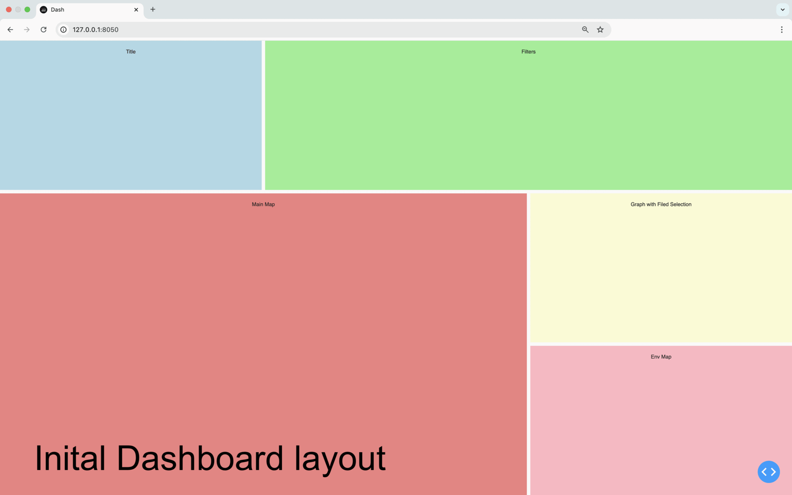
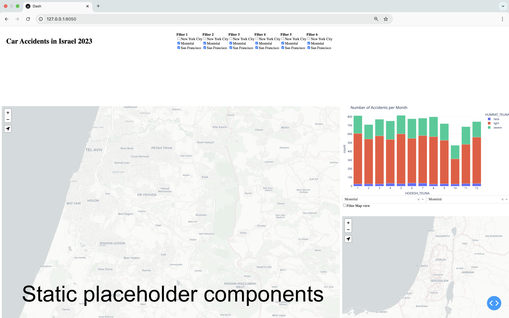

# Building a Dashboard with a Map: Step-by-Step Using Dash-Plotly and Dash-Leaflet

In this post, I’ll walk you through building a dashboard with a map step by step, using Dash-Plotly and Dash-Leaflet. Whether you’re a beginner/intermediate data scientist or transitioning a GIS analyst with data science tools, this guide will help you explore how to combine interactive visualizations with geographic data in a user-friendly interface.

Here’s what we’ll cover in this tutorial:
1.	Building a Complex Dashboard Step by Step: Learn to create a functional, interactive dashboard by designing it from scratch. We’ll walk through adding elements step by step, implementing callback interactivity, and applying styling to make it polished and user-friendly.
2.	Working with Geographic Data: Understand the basics of Dash-Leaflet for adding spatial data to your dashbaord.
3.	Best Practices in Python: Incorporate good coding practices to make your dashboard maintainable and scalable.
4.	Dash-Plotly Tricks: Simplify some challenging aspects of Dash-Plotly with helpful tips and techniques. 

The dashboard we’ll create will provide statistical insights and interactive map visualizations related to car accidents in Israel. It will feature a contextual bar graph that dynamically updates based on user selections, along with two maps: a large map displaying geographic data points and a smaller environmental map showing the bounding box of the larger map.

If you’re a data scientist exploring web technologies, Dash-Plotly offers a fantastic starting point for building interactive dashboards and applications. Dash-Plotly is essentially a Python framework built on React and Flask, combining frontend interactivity with Python’s simplicity. Here’s why it’s worth learning:
1. HTML and CSS Basics: Dash uses common tags as in HTML, it's an opportunity to learn foundational web design concepts for structuring and styling web-apps.
2. React Potential: Dash is a Python wrapper to React. Basicly it acts as a bridge to understanding React. You can quickly prototype ideas and later dive deeper into React’s capabilities.
3. Flask Framework: Since Dash is built on Flask, it introduces you to one of Python’s most popular frameworks for creating APIs and integrating frontend and backend functionalities.
4. Coding Practice: Unlike platforms like Tableau or Power BI, Dash requires you to code your dashboards, providing more flexibility and customization. However, this also means that your code can quickly become cumbersome and difficult to manage. Dash offers an opportunity to practice/learn writing clean, organized, and maintainable code—skills that are crucial for developing scalable and efficient applications.
5. Deployment Opportunities: Dash applications can be deployed on platforms like AWS, Azure, or GCP, giving you hands-on experience in web deployment.
6. Exploratory Data Analysis (EDA): Building a dashboard involves data wrangling, cleaning, and exploration—core skills for any data scientist. Dash makes EDA interactive and engaging.
7. Beyond Dashboards: Dash isn’t just for dashboards; it can power simulations, prototypes, or custom data-driven applications. Check out the Dash-Plotly Gallery for inspiration.

In addition to creating a classic interactive dashboard, a significant portion of this post focuses on Dash-Leaflet—a Dash wrapper for the popular JavaScript mapping library, Leaflet. If you’re unfamiliar with this Dash component, you can think of it as a tool similar to Folium (a Python wrapper for Leaflet) but designed specifically for Dash-Plotly. However, this comparison isn’t entirely accurate. Unlike Folium, Dash-Leaflet directly wraps the JavaScript Leaflet library, making it more similar to React-Leaflet, which is a React wrapper for Leaflet.

If the previous paragraph wasn’t entirely clear, that’s okay! The key takeaway about Dash-Leaflet is that it enables you to create Leaflet-like maps (with many of its powerful features) that seamlessly interact with Dash-Plotly.

Before diving into the implementation, it’s crucial to design the dashboard and plan the execution steps for building it effectively.

The goal of this dashboard is to gain insights into the spatio-temporal statistics of car accidents in Israel during 2023.

Here is the breakdown of the steps:
#### Part 1. Sketching the Dashboard's layout
1.	Sketch the Dashboard Concept: Start by sketching what you want the dashboard to showcase.
2.	Add Static Elements: Place static Plotly elements in the layout as placeholders.

#### Part 2. Data Driven conent
3.	Replace Static Elements: Exchange the static Plotly elements with data-driven plotly components from the dataset.
4.	Introduce Interactivity: Add initial callbacks to enable basic interaction between components.

#### Part 3. Setting up the map
5.	Enable an Environment Map: the environment map displays the boundig box of the main-maps viewport.
6. Load Geographic Data: Integrate geographic data into the map.
7.	Unify Styling: Match the styles of the graph and map components for a cohesive design.
8.	Add Cluster Layers: Include clustering functionality on the environment map.

#### Part 4. enabling interacitivy between the map and the other component of the dashboard
9. Filter Data to the Map: Allow filters to modify the content on the map dynamically.
10.	Filter by viewport: Enable interactions where data displayed  on the map viewports updates the graphs, and vice versa.


#### Part 5. Fine tuning the style using CSS
11.	Enhance Visual Design: Use CSS to refine the map’s appearance and overall dashboard aesthetics.


The following gif animation displays (more-less) the different steps described above.


The source of the data comes from accdients dataset From data.gov.il (Israel open source govemenral data website),
The data has been processed and translated to enlgish in order to simplify the process.

So without further due lets start learning how to build the dashboard step by step!

## 0. Setting up an environment
 Setting up a development environment is beyond the scope of this blog post, with that said,  we highly recommend creating a dedicated virtual environment specifically for this project. This approach helps keep dependencies organized and prevents conflicts with other projects. Once the virtual environment is ready, install the required libraries to proceed.

```sh
pip install -r requirements.txt
```

## 1. Sketching the Dashboard's layout

Typically, the first step in designing a dashboard is to define the key questions the dashboard aims to address. Once these are clear, it’s helpful to sketch the layout and components on paper (preferably) to plan the structure effectively. However, in this blog, we’ll skip the planning phase and fast-forward into creating the initial dashboard layout using code.

In the following code, I created a 3x3 grid layout using html.Div elements and added placeholders as titles for the components I intend to include. I then merged some of the components that I anticipated would require more screen space, using the girdColumn/girdRow:span in the style. The resulting layout can be seen in the screenshot below the code snippet. 

```python
from dash import Dash, html
import plotly.express as px

app = Dash()


cell_style = {'padding': '20px',
              'text-align': 'center'}

# Set the layout right the first time!
app.layout = html.Div(
    style={
        'display': 'grid',
        'gridTemplateColumns': '33% 33% 33%',
        'gridTemplateRows': '20% 40% 40%',
        'gap': '10px',
        'height': '100vh',
        'width': '100vw',
    },
    children=[
        html.Div('Title', style={
                 'backgroundColor': 'lightblue', **cell_style}),
        html.Div('Filters', style={
                 'backgroundColor': 'lightgreen', 'gridColumn': 'span 2', **cell_style}),
        html.Div('Main Map', style={'backgroundColor': 'lightcoral',
                 **cell_style, 'gridColumn': 'span 2', 'gridRow': 'span 2'}),
        html.Div(['Graph with Filed Selection'], style={
                 'backgroundColor': 'lightgoldenrodyellow', **cell_style}),
        html.Div(['Env Map'], style={
                 'backgroundColor': 'lightpink', **cell_style})
    ]
)
if __name__ == "__main__":
    app.run(debug=True)
```
> **Note:** In the code, I incorporated some CSS styling practices and utilized html.Div components from Dash-Plotly. These concepts are rooted in the CSS/HTML front-end development context, which is beyond the scope of this blog post. However, if you’re curious or need more details, feel free to consult your GPT or search the internet for further information.


## 2. Add Static Elements

After setting up the initial layout, the next step is to place the Plotly and Leaflet elements within their designated div containers. Below, you’ll find the code snippets along with comments explaining what was done and why. At the end of this section, you’ll see a snapshot of the result at this stage. 

> **Note:** The following code simply copies sample code from the Dash-Plotly tutorial into the various div containers in the layout. This step serves primarily as a placeholder for the UI widgets. Since there’s nothing particularly complex about this step, I won’t go into detailed explanations here.

<details>
  <summary>Click to expand the code snippet</summary>

```python
from dash import Dash, html, dcc, callback, Output, Input
import dash_leaflet as dl
import plotly.express as px
import pandas as pd
import os

##### Load data

# get the absolute dir location of the working file
file_dir = os.path.dirname(__file__)


# Processed data from https://data.gov.il/dataset/2023-puf
df = pd.read_csv(os.path.join(file_dir, 'accidents_2023_processed.csv'))

# At this step the dataframe will only be used to generate a static figure that is not yet linked to the other parts of the dashbaord

# Generate monthly accidents counts grouped by accident severity, this will be used in creating the figure in next part 
monthly_accidents = df.groupby(
    ['HODESH_TEUNA', 'HUMRAT_TEUNA']).size().reset_index(name='count')

# Inital plot placeholder for dashbaord, we used the accidents count calculated above
fig = px.bar(monthly_accidents, x='HODESH_TEUNA', y='count', color='HUMRAT_TEUNA',
             title='Number of Accidents per Month', template='plotly_white')
fig.update_layout(xaxis=dict(tickmode='linear'),
                  margin=dict(l=0, r=0, t=25, b=25), height=400)

# Main Map Component
dah_main_map = dl.Map([
                    dl.TileLayer(
                        url='https://{s}.basemaps.cartocdn.com/light_all/{z}/{x}/{y}{r}.png'),

                    dl.LocateControl(
                        locateOptions={'enableHighAccuracy': True})
                ],
                    center=[32, 34.9],
                    zoom=12,
                    style={'height': '100%'},
                    id='main_map',
                    dragging=True,
                    zoomControl=True,
                    scrollWheelZoom=True,
                    doubleClickZoom=True,
                    boxZoom=True,
                )

# Environmental Map Component
dash_env_map = dl.Map([
                    dl.TileLayer(
                        url='https://{s}.basemaps.cartocdn.com/light_all/{z}/{x}/{y}{r}.png')
                ],
                    center=[32, 34.9],
                    zoom=8,
                    style={'height': '100%'},
                    id='env_map',
                    dragging=False,
                    zoomControl=False,
                    scrollWheelZoom=False,
                    doubleClickZoom=False,
                    boxZoom=False,
                )
app = Dash()


cell_style = {'padding': '20px'}
# Set the layout right the first time!
app.layout = html.Div(
    style={
        'display': 'grid',
        'gridTemplateColumns': '33% 33% 33%',
        'gridTemplateRows': '26% 37% 37%',
        'gap': '10px',
        'height': '100vh',
        'width': '100vw'
    },
    children=[
        # Main Title
        html.Div(
            html.H1('Car Accidents in Israel 2023'),
            style={**cell_style}
        ),
        # Filters Section
        html.Div(
            [
                html.Div(
                    [
                        html.B('Filter 1'),
                        dcc.Checklist(
                            ['New York City', 'Montréal', 'San Francisco'],
                            ['Montréal', 'San Francisco']
                        )
                    ]
                ),
                html.Div(
                    [
                        html.B('Filter 2'),
                        dcc.Checklist(
                            ['New York City', 'Montréal', 'San Francisco'],
                            ['Montréal', 'San Francisco']
                        )
                    ]
                ),
                html.Div(
                    [
                        html.B('Filter 3'),
                        dcc.Checklist(
                            ['New York City', 'Montréal', 'San Francisco'],
                            ['Montréal', 'San Francisco']
                        )
                    ]
                ),
                html.Div(
                    [
                        html.B('Filter 4'),
                        dcc.Checklist(
                            ['New York City', 'Montréal', 'San Francisco'],
                            ['Montréal', 'San Francisco']
                        )
                    ]
                ),
                html.Div(
                    [
                        html.B('Filter 5'),
                        dcc.Checklist(
                            ['New York City', 'Montréal', 'San Francisco'],
                            ['Montréal', 'San Francisco']
                        )
                    ]
                ),
                html.Div(
                    [
                        html.B('Filter 6'),
                        dcc.Checklist(
                            ['New York City', 'Montréal', 'San Francisco'],
                            ['Montréal', 'San Francisco']
                        )
                    ]
                ),
            ],
            style={'gridColumn': 'span 2', 'display': 'flex', **cell_style}
        ),
        # Main Map Div
        html.Div(
            dah_main_map,
            style={'gridColumn': 'span 2', 'gridRow': 'span 2'}
        ),
        # Contextual Graph Div
        html.Div(
            [
                dcc.Graph(figure=fig, id='contextual_graph'),
                html.Div(
                    [
                        html.Div(
                            dcc.Dropdown(
                                ['New York City', 'Montréal', 'San Francisco'],
                                'Montréal'
                            ),
                            style={'flex': '1', 'textAlign': 'left'}
                        ),
                        html.Div(
                            dcc.Dropdown(
                                ['New York City', 'Montréal', 'San Francisco'],
                                'Montréal'
                            ),
                            style={'flex': '1', 'textAlign': 'left'}
                        )
                    ],
                    style={'display': 'flex'}
                ),
                dcc.Checklist(['Filter Map-view']),
            ]
        ),
        # Environmental Map Div
        html.Div(dash_env_map)
    ]
)

if __name__ == "__main__":
    app.run(debug=True)
```
</details>


